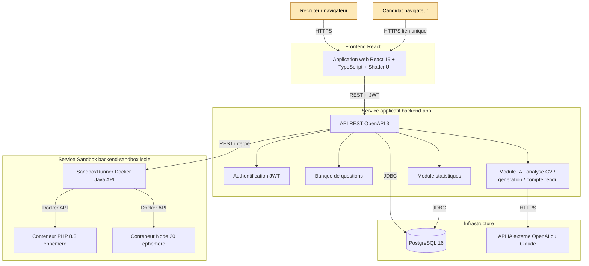
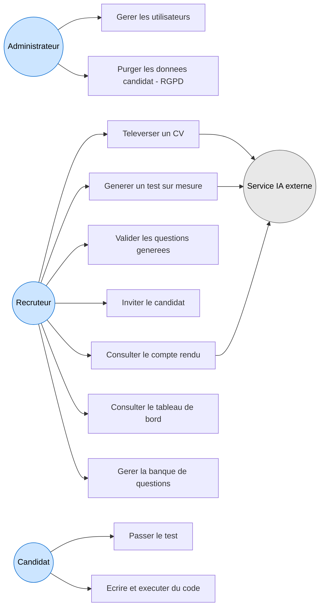
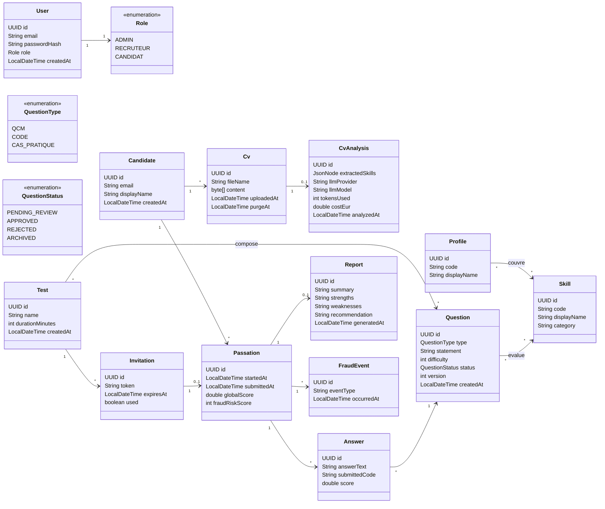
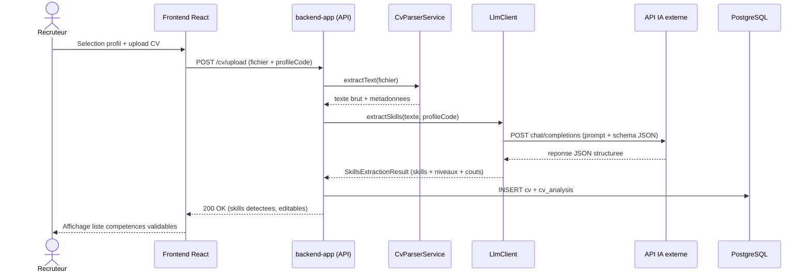
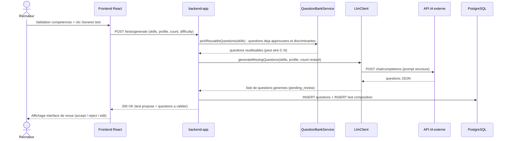
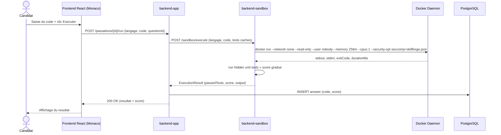
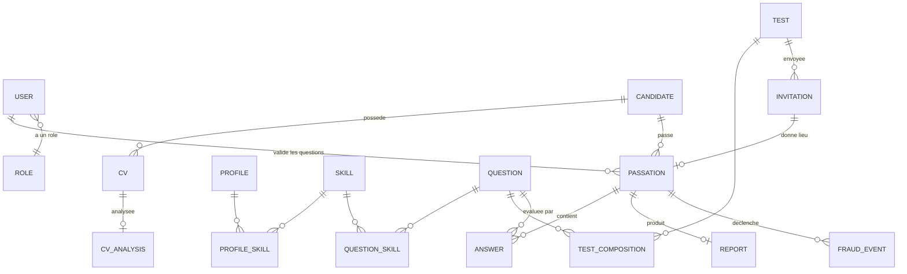

# Dossier de conception

Ce document regroupe l'ensemble des éléments de conception du projet SkillForge : architecture technique, diagrammes UML (cas d'usage, classes, séquences), modèle de données (MCD Merise, MLD, MPD), et choix structurants.

> Tous les diagrammes sont en **Mermaid** pour pouvoir être versionnés en texte aux côtés du code. Ils sont rendus directement par GitHub, GitLab et la plupart des éditeurs Markdown.

## 1. Architecture technique

### 1.1 Vue d'ensemble

L'architecture repose sur **deux services Spring Boot séparés** pour des raisons de sécurité : la sandbox exécute du code venant de l'extérieur (potentiellement malveillant), il est donc essentiel de l'isoler du service applicatif principal qui gère la base de données et les utilisateurs.



### 1.2 Pourquoi deux services et pas un seul ?

La sandbox exécute du code arbitraire fourni par le candidat. Même avec un durcissement Docker complet (seccomp, capabilities, etc.), il subsiste un **risque résiduel d'évasion** (faille du noyau Linux, faille de Docker). En isolant la sandbox dans un service séparé :

- si l'attaquant s'échappe d'un conteneur, il atterrit dans un service vide, sans base de données ni informations utilisateur ;
- le service applicatif principal reste protégé même en cas de compromission de la sandbox ;
- les deux services peuvent être déployés sur des machines différentes en production si nécessaire.

## 2. Diagrammes UML

### 2.1 Diagramme de cas d'usage



### 2.2 Diagramme de classes (domaine métier)



### 2.3 Diagramme de séquence — Analyse du CV par IA



### 2.4 Diagramme de séquence — Génération adaptative de tests



### 2.5 Diagramme de séquence — Exécution sécurisée de code



## 3. Modèle de données

### 3.1 MCD Merise



### 3.2 MLD (tables + colonnes essentielles)

| Table | Colonnes principales | Clés |
|---|---|---|
| `users` | id (UUID PK), email, password_hash, role, created_at | PK id, UQ email |
| `profiles` | id, code (UQ), display_name | PK id |
| `skills` | id, code (UQ), display_name, category | PK id |
| `profile_skills` | profile_id, skill_id | PK composite, FK profiles, skills |
| `questions` | id, type, statement (TEXT), difficulty (1-5), status, version, json_payload (JSONB), created_at | PK id |
| `question_skills` | question_id, skill_id | PK composite, FK |
| `candidates` | id, email, display_name, created_at | PK id, UQ email |
| `cvs` | id, candidate_id (FK), file_name, content (BYTEA), uploaded_at, purge_at | PK id |
| `cv_analyses` | id, cv_id (FK UQ), extracted_skills (JSONB), llm_provider, llm_model, tokens_used, cost_eur, analyzed_at | PK id |
| `tests` | id, name, duration_minutes, created_at | PK id |
| `test_compositions` | test_id, question_id, position | PK composite |
| `invitations` | id, test_id (FK), token (UQ), expires_at, used | PK id |
| `passations` | id, invitation_id (FK UQ), candidate_id (FK), started_at, submitted_at, global_score, fraud_risk_score | PK id |
| `answers` | id, passation_id (FK), question_id (FK), answer_text, submitted_code, score | PK id |
| `reports` | id, passation_id (FK UQ), summary, strengths, weaknesses, recommendation, generated_at | PK id |
| `fraud_events` | id, passation_id (FK), event_type, occurred_at | PK id |

### 3.3 MPD (script SQL initial)

Le script complet est généré et versionné par **Flyway** sous `apps/backend-app/src/main/resources/db/migration/V1__init.sql`. Il sera produit au Sprint 1.

## 4. Sécurité — synthèse des choix structurants

| Couche | Mécanisme |
|---|---|
| Transport | TLS 1.3 obligatoire |
| Authentification | JWT signés (HS256 ou RS256) + refresh token |
| Mots de passe | Argon2id (Spring Security) |
| Liens candidats | UUID v4 + expiration (24 h par défaut) + usage unique |
| API publique | Rate limiting (Bucket4j) sur les endpoints sensibles |
| Sandbox | `--network none`, `--read-only`, `--user nobody`, `--memory=256m`, `--cpus=1`, `--security-opt seccomp=skillforge.json`, `--cap-drop=ALL`, timeout 5 s |
| RGPD | Consentement explicite avant analyse CV, droit à l'oubli (purge complète d'un candidat), purge automatique des CV après 12 mois, registre des traitements |
| Audit | Journal d'audit pour toutes les actions sensibles (création test, validation questions, consultation résultats, exports) |

## 5. Choix d'organisation du code (à venir Sprint 1)

Le backend Spring Boot adoptera une organisation **en couches classique** mais propre :

```
src/main/java/com/tsarajoro/skillforge/
├── config/         # configuration Spring, sécurité, beans
├── domain/         # entités JPA, value objects, enums métier
├── repository/     # interfaces Spring Data JPA
├── service/        # logique métier
├── llm/            # abstraction LLM (interface + impls OpenAI / Claude / mock)
├── controller/     # contrôleurs REST + DTO
└── exception/      # gestion centralisée des erreurs
```

Le frontend React adoptera une organisation par **feature** :

```
src/
├── features/
│   ├── auth/
│   ├── cv-upload/
│   ├── test-generation/
│   ├── passation/
│   ├── reports/
│   └── dashboard/
├── components/ui/   # composants ShadcnUI
├── lib/             # client API, hooks utilitaires
└── routes/
```
