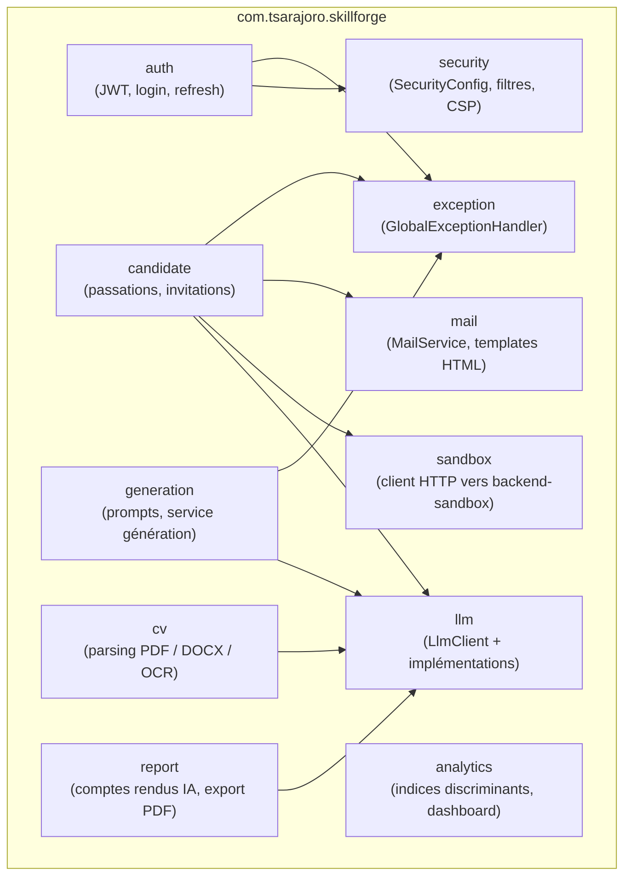
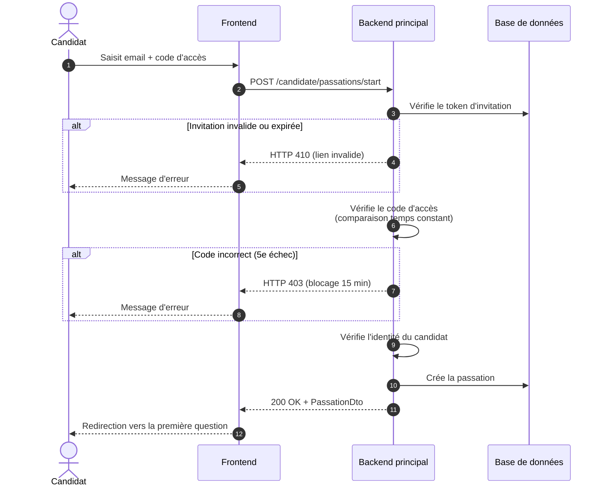

# À faire à la maison — 3 dernières figures du mémoire

**Objectif :** insérer les 3 dernières images manquantes dans
`MEMOIRE-itu-MBDS-v2.docx`.

**Durée totale estimée :** ~30 minutes.

**Ordre recommandé :** Figure 10 → Figure 12 → Figure 1
(les 2 Mermaid d'abord car même outil, le Gantt en dernier).

---

## Ce qu'il te faut

- Ton fichier `MEMOIRE-itu-MBDS-v2.docx` ouvert dans Word / LibreOffice
- Une connexion internet
- Ton fichier `docs/SkillForge_Planning.gan` (pour le Gantt)
- **GanttProject Desktop** installé (téléchargement gratuit : https://www.ganttproject.biz)

---

# Figure 10 — Organisation des principaux packages du backend

## Emplacement dans le mémoire

Chapitre **7.2.2 "Le code source – vue statique"**.
Tu chercheras dans le texte la légende `Figure 10 : Organisation des principaux packages du backend SkillForge` — l'image doit venir juste au-dessus de cette légende.

## Étapes

**1.** Ouvre https://mermaid.live/ dans ton navigateur.

**2.** Efface tout le contenu par défaut dans la zone de gauche.

**3.** Colle le code suivant :

**4.** Le rendu apparaît à droite. Vérifie que tu vois bien tous les packages (auth, cv, generation, candidate, report, analytics, mail, sandbox, llm, security, exception).

**5.** En haut à droite, clique **Actions → PNG**. L'image se télécharge.
    (Renomme si tu veux : `figure_10_packages.png`)

**6.** Dans Word / LibreOffice :
   - Va au chapitre 7.2.2
   - Clique juste au-dessus de la ligne `Figure 10 : Organisation des principaux packages...`
   - Insertion → Image → sélectionne l'image téléchargée
   - Centre l'image, redimensionne si nécessaire

---

# Figure 12 — Séquence interne de l'accès sécurisé à une passation

## Emplacement dans le mémoire

Chapitre **7.2.4 "Réalisation des cas d'utilisation"**.
Tu chercheras dans le texte la légende `Figure 12 : Séquence interne de l'accès sécurisé à une passation` — l'image doit venir juste au-dessus.

## Étapes

**1.** Reste sur https://mermaid.live/ (même onglet que Figure 10).

**2.** Efface le contenu précédent.

**3.** Colle le code suivant :

**4.** Le rendu apparaît à droite. Tu dois voir un diagramme de séquence avec 4 colonnes verticales : Candidat, Frontend, Backend principal, Base de données, avec des flèches horizontales entre elles.

**5.** Actions → PNG → télécharge.
    (Renomme : `figure_12_sequence.png`)

**6.** Dans Word :
   - Va au chapitre 7.2.4
   - Insère l'image juste au-dessus de la légende `Figure 12 : ...`
   - Centre et redimensionne

---

# Figure 1 — Macro-planning du projet SkillForge (Gantt)

## Emplacement dans le mémoire

Chapitre **4.4 "Planification"**.
Tu chercheras dans le texte le placeholder `[INSÉRER ICI UN DIAGRAMME DE GANTT MACRO DU PROJET]` — l'image doit remplacer ce placeholder.

## Étapes

**1.** Télécharge et installe **GanttProject Desktop** depuis https://www.ganttproject.biz
    (Bouton "Free download", disponible Linux/Mac/Windows.)

**2.** Lance GanttProject.

**3.** **Fichier → Ouvrir** → sélectionne le fichier
    `docs/SkillForge_Planning.gan` (dans ton projet skillforge-platform).

    Note : tu as 3 versions disponibles dans le dossier `docs/` :
    - `SkillForge_Planning.gan` : par sprints S0 à S8 (recommandé)
    - `SkillForge_Planning_v2_phases.gan` : par 3 phases (Cadrage/Dev/Finalisation)
    - `SkillForge_Planning_v3_pocs.gan` : par POCs (met les 4 POC en avant)
    Choisis celle qui te plaît le plus visuellement.

**4.** Vérifie et ajuste si besoin :
   - Les 3 jalons de soutenance (losanges rouges) : ajuste les dates si le
     prof t'a communiqué des dates différentes des miennes (double-clic sur
     le jalon → changer la date).
   - Les couleurs par défaut sont bleu-gris ; tu peux les changer via
     Édition → Options → Couleurs des tâches.

**5.** **Fichier → Exporter le projet → PNG image**
   - Une fenêtre de dialogue s'ouvre
   - Choisis "Diagramme de Gantt" (pas "Diagramme des ressources")
   - Ajuste la largeur (2400 px conseillé pour un rendu net)
   - Enregistre le fichier PNG où tu veux
    (Renomme : `figure_1_gantt.png`)

**6.** Dans Word :
   - Va au chapitre 4.4
   - Trouve la ligne `[INSÉRER ICI UN DIAGRAMME DE GANTT MACRO DU PROJET]`
   - Supprime cette ligne
   - Insertion → Image → sélectionne `figure_1_gantt.png`
   - La légende `Figure 1 : Macro-planning du projet SkillForge` est déjà
     dans ton texte, il suffit que l'image soit juste au-dessus.

---

# Récapitulatif final

Une fois les 3 images insérées, tu auras dans ton mémoire :

**Figures dans l'ordre :**
- Figure 1 : Macro-planning du projet SkillForge ✅ (celle du Gantt)
- Figure 2 : Diagramme global des cas d'utilisation (déjà présente)
- Figures 3 à 7 : Captures d'interfaces (déjà présentes)
- Figure 8 : Architecture logicielle (déjà présente)
- Figure 9 : Architecture technique (déjà présente)
- Figure 10 : Organisation des packages backend ✅ (celle de Mermaid)
- Figure 11 : Modèle de données (déjà présente)
- Figure 12 : Séquence interne accès sécurisé ✅ (celle de Mermaid)

**Tableaux :**
- Tableaux 1 à 8 (le Tableau 8 sur les tests de sécurité est le dernier ajouté)

**Total : 12 figures + 8 tableaux.**

---

## Astuces générales

- **Résolution PNG** : sur mermaid.live et GanttProject, vise 2400 px de large
  pour que l'image reste lisible même imprimée.
- **Centrage dans Word** : sélectionne l'image → onglet Accueil → alignement
  centré.
- **Légende Word automatique** : tu peux utiliser Références → Insérer une
  légende, ça permet de générer automatiquement la Liste des figures.
- **Ne renumérote pas** : les Figure 10 / 12 / 1 correspondent déjà aux
  numéros attendus dans ton texte, ne les change pas.

---

*Fiche créée pour t'aider à finaliser le mémoire à la maison.
Une fois les 3 images intégrées, on passera au renforcement du chapitre 8
puis au nettoyage final (glossaire, biblio, table des matières).*
