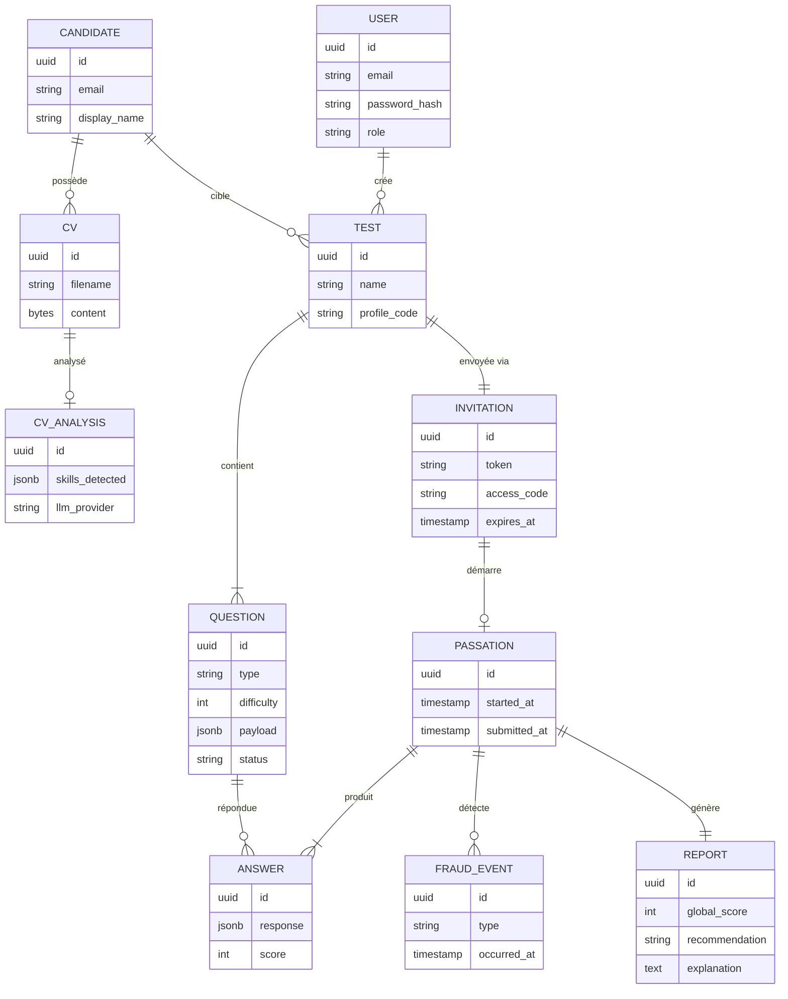
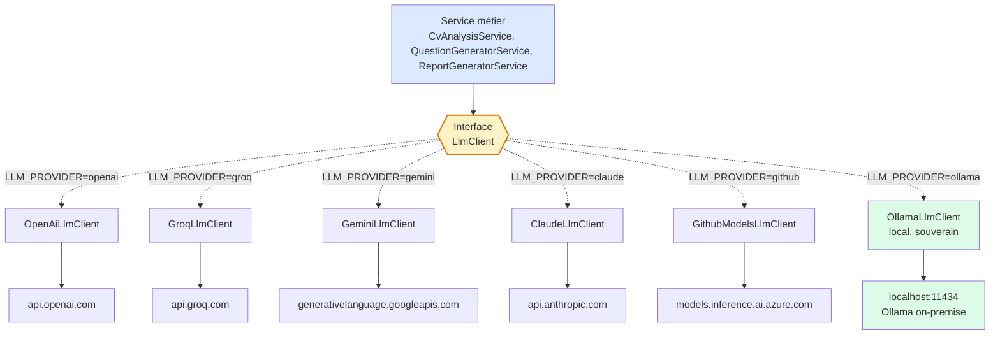

# À faire à la maison — Images restantes pour le mémoire

**Objectif :** produire toutes les images manquantes pour finaliser
`MEMOIRE-itu-MBDS-v2.docx`.

**Durée totale estimée :** ~1 heure.

---

## Vue d'ensemble : ce qu'il reste à faire

| # | Emplacement dans le mémoire | Statut | Ce qu'il faut produire |
|---|---|---|---|
| **1** | Figure 11 (page 52, corps) | ⚠️ Bug : image dupliquée | **1 image** : MCD conceptuel (mermaid) |
| **2** | Annexe 1 — Figure 13 | À créer | **1 image** : MPD complet (DBeaver) |
| **3** | Annexe 2 — Figures 14 à 16 | À créer | **3 captures** d'interfaces |
| **4** | Annexe 3 — Figure 17 | À créer | **1 image** : schéma sandbox (mermaid) |
| **5** | Annexe 4 — Figure 18 | À créer | **1 image** : schéma multi-providers LLM (mermaid) |

**Total : 7 images à produire (Figure 11 corrigée + Figures 13 à 18).**

**Note importante sur la numérotation :** ton mémoire s'arrête à **Figure 12** dans le corps. Les annexes continuent donc naturellement à **Figure 13** puis 14, 15, 16, 17, 18 — pas de saut, pas de trou.

---

# IMAGE 1 — Figure 11 : Modèle de données de SkillForge (CORRECTION)

**Emplacement :** page 52 du mémoire, chapitre 7.2.3 « Modélisation de données »
**Type :** MCD conceptuel (entités-relations)
**Outil :** mermaid.live
**Durée :** 5 min

## Problème

Dans la v2 actuelle, Figure 11 (page 52) affiche la même image que Figure 10
(page 51) — les packages backend. Or Figure 11 doit être le modèle
conceptuel de données.

## Étapes

**1.** Ouvre https://mermaid.live/
**2.** Efface le contenu par défaut
**3.** Colle le code suivant :



**4.** Actions → PNG (renomme en `figure_11_mcd.png`)
**5.** Dans Word, page 52 : remplace l'image dupliquée par `figure_11_mcd.png`
**6.** La légende « Figure 11 : Modèle de données de SkillForge » reste inchangée

---

# IMAGE 2 — Annexe 1 : Modèle physique complet (MPD)

**Emplacement :** nouvelle Annexe 1, à insérer après le chapitre 10 Bibliographie
**Type :** MPD physique (toutes les tables SQL + colonnes + clés étrangères)
**Outil :** DBeaver (auto-généré depuis la BDD PostgreSQL)
**Durée :** 10 min

## Pourquoi DBeaver et pas mermaid ?

DBeaver produit un rendu identique à celui du mémoire MADIS (tables colorées
avec colonnes détaillées et flèches FK). Auto-généré depuis la vraie base
de données → zéro risque d'oubli de table ou de colonne.

## Étapes

**1.** Vérifie que DBeaver est installé :

```bash
which dbeaver || sudo pacman -S dbeaver
```

**2.** Vérifie que le backend tourne (la BDD PostgreSQL doit être accessible) :

```bash
cd ~/Documents/st/skillforge-platform
docker compose ps
```

Si la BDD n'est pas démarrée :

```bash
docker compose up -d postgres
```

**3.** Ouvre DBeaver, crée une nouvelle connexion PostgreSQL avec les
paramètres définis dans `apps/backend-app/.env` (host: localhost, port: 5432,
database: skillforge_db, user + password: cf .env).

**4.** Dans l'arbre à gauche, déplie :
`skillforge_db → Schemas → public → Tables`

**5.** Clic droit sur **Tables** → **View Diagram**

**6.** DBeaver génère automatiquement le diagramme complet. Attends
quelques secondes que la disposition se stabilise.

**7.** Ajuste si nécessaire :
   - Zoom pour que tout soit lisible
   - Déplace les tables trop chevauchées

**8.** Menu contextuel sur le diagramme → **Save as image** → choisis PNG
avec la résolution maximum. Nomme le fichier `figure_13_mpd.png`.

**9.** Dans Word, insère cette image dans l'Annexe 1 (voir texte
d'accompagnement dans `docs/MEMOIRE_ANNEXES.md`).

## Astuce

Si DBeaver refuse à cause de la BDD non démarrée, tu peux aussi passer par
un outil en ligne comme https://dbdiagram.io/ en collant le schéma SQL
extrait de tes migrations Flyway (V1 à V7). Mais DBeaver reste plus rapide
et plus fidèle.

---

# IMAGE 3 — Annexe 2 : Captures d'interfaces complémentaires

**Emplacement :** nouvelle Annexe 2
**Type :** captures d'écran de l'application en local
**Outil :** ton système (Print Screen ou outil de capture)
**Durée :** 15 min

## Écrans à capturer

Vise **3 à 4 captures d'interfaces qui ne sont PAS déjà dans le corps du
mémoire**. Les Figures 3 à 7 (corps) montrent déjà : création d'évaluation,
validation des questions, passation, exercice de code, résultats.

**Écrans complémentaires à capturer (choisis-en 3 ou 4) :**

| # | Écran | URL locale | Nom fichier suggéré |
|---|---|---|---|
| A | Liste des tests (tableau avec filtres) | http://localhost:5173/app/review | `figure_14_liste_tests.png` |
| B | Détail d'un rapport candidat complet | http://localhost:5173/app/reports/{id} | `figure_15_rapport.png` |
| C | Dashboard analytique recruteur | http://localhost:5173/app/dashboard | `figure_16_dashboard.png` |

## Étapes

**1.** Démarre l'application complète :

```bash
cd ~/Documents/st/skillforge-platform
docker compose up -d postgres mailpit
cd apps/backend-app && mvn spring-boot:run &
cd ../backend-sandbox && mvn spring-boot:run &
cd ../frontend-web && npm run dev
```

**2.** Ouvre http://localhost:5173, connecte-toi avec un compte recruteur.

**3.** Pour chaque écran choisi :
   - Navigue jusqu'à l'écran
   - Attends que les données se chargent (pas d'écran vide)
   - Utilise **Print Screen** (ou `gnome-screenshot -a` pour capturer une zone)
   - Sauvegarde en PNG

**4.** Vérifie que chaque capture contient :
   - Toute la zone utile (pas coupée)
   - Aucune donnée personnelle sensible (utilise des candidats fictifs de démo)
   - Bonne résolution (viser 1600 px de large minimum)

**5.** Dans Word, insère les 3 images dans l'Annexe 2 avec les légendes
Figure 14, Figure 15, Figure 16.

---

# IMAGE 4 — Annexe 3 : Schéma de la sandbox durcie

**Emplacement :** nouvelle Annexe 3
**Type :** schéma d'architecture de la sandbox Docker
**Outil :** mermaid.live
**Durée :** 5 min

## Étapes

**1.** Ouvre https://mermaid.live/
**2.** Colle le code suivant :



```mermaid
flowchart LR
    A[Candidat<br/>navigateur] -->|Code soumis| B[backend-app<br/>Spring Boot]
    B -->|HTTP interne| C[backend-sandbox<br/>service isolé]
    C -->|docker run| D[Conteneur éphémère]

    subgraph D[Conteneur d'exécution isolé]
        direction TB
        E[seccomp<br/>syscalls filtrés]
        F[cap-drop=ALL<br/>aucune capability]
        G[network=none<br/>pas de réseau]
        H[read-only rootfs<br/>FS non modifiable]
        I[pids-limit=64<br/>fork bomb bloqué]
        J[memory=256M<br/>cpus=1]
        K[user=1001<br/>non-root]
    end

    D -->|stdout / stderr / exit code| C
    C -->|Résultat| B
    B -->|Score + feedback| A

    style D fill:#fff4e6,stroke:#d97706,stroke-width:2px
    style A fill:#e0f2fe
    style B fill:#dbeafe
    style C fill:#dbeafe
```

**3.** Actions → PNG → nomme `figure_17_sandbox.png`
**4.** Insère dans Annexe 3 dans Word (légende : Figure 17)

---

# IMAGE 5 — Annexe 4 : Schéma multi-providers LLM

**Emplacement :** nouvelle Annexe 4
**Type :** schéma d'abstraction des fournisseurs LLM
**Outil :** mermaid.live
**Durée :** 5 min

## Étapes

**1.** Ouvre https://mermaid.live/
**2.** Colle le code suivant :



**3.** Actions → PNG → nomme `figure_18_llm_providers.png`
**4.** Insère dans Annexe 4 dans Word (légende : Figure 18)

---

# Récapitulatif final — checklist à cocher

Coche au fur et à mesure. Quand tout est coché, le mémoire est complet côté
images.

## Corps du mémoire (correction)

- [ ] **Figure 11** (page 52) : MCD conceptuel généré via mermaid.live et
      inséré à la place de l'image dupliquée

## Annexes (créations)

- [ ] **Annexe 1 — Figure 13** : MPD complet exporté depuis DBeaver
- [ ] **Annexe 2 — Figures 14, 15, 16** : 3 captures d'interfaces
      complémentaires
- [ ] **Annexe 3 — Figure 17** : schéma sandbox généré via mermaid.live
- [ ] **Annexe 4 — Figure 18** : schéma multi-providers LLM généré via
      mermaid.live

## Numérotation finale des figures

Après ces ajouts, le mémoire contiendra une numérotation **continue** de
Figure 1 à Figure 18 :

**Corps du mémoire :**
- Figure 1 à 12 (déjà présentes ou corrigées)

**Annexes :**
- Figure 13 — MPD complet (Annexe 1)
- Figure 14 — Liste des évaluations (Annexe 2)
- Figure 15 — Rapport candidat (Annexe 2)
- Figure 16 — Dashboard analytique (Annexe 2)
- Figure 17 — Sandbox (Annexe 3)
- Figure 18 — Multi-providers LLM (Annexe 4)

Continuité parfaite, aucun numéro sauté.

## Table des figures

Après avoir inséré toutes les images, dans Word :
Références → Insérer une table des illustrations (ou clique droit sur la
table existante → Mettre à jour les champs) pour régénérer la liste
automatiquement.

---

*Fiche mise à jour le 2026-09-23 — remplace toutes les versions précédentes.*
