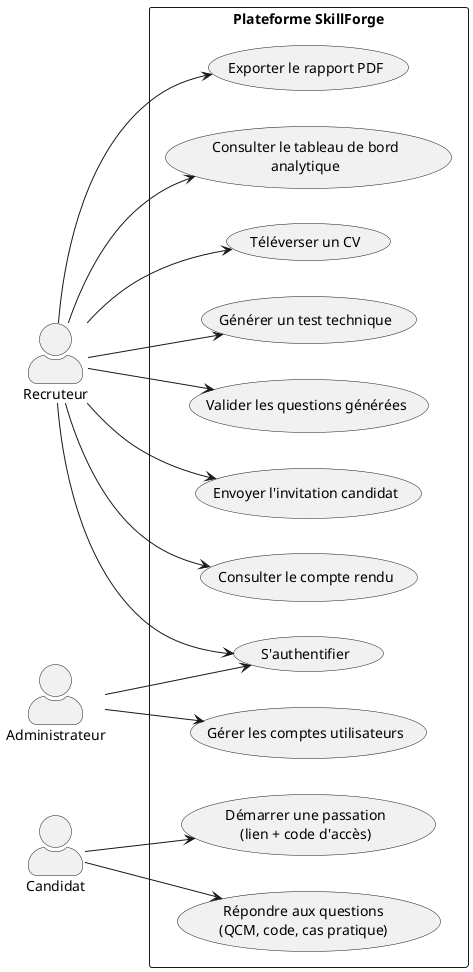
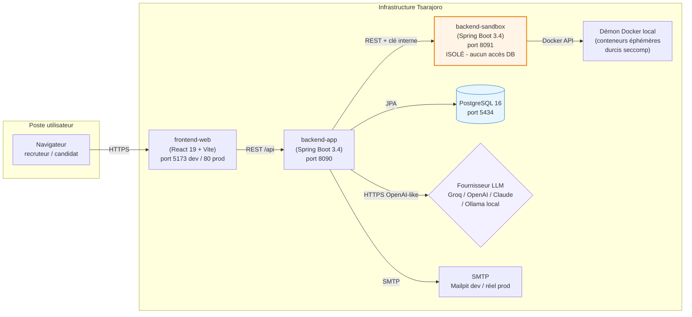
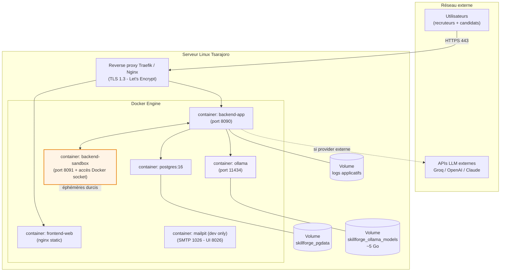
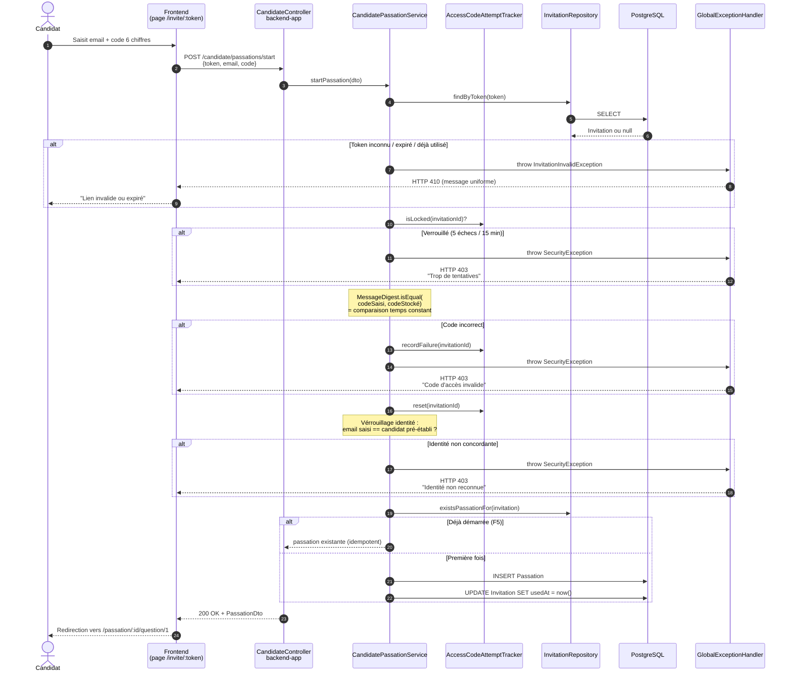
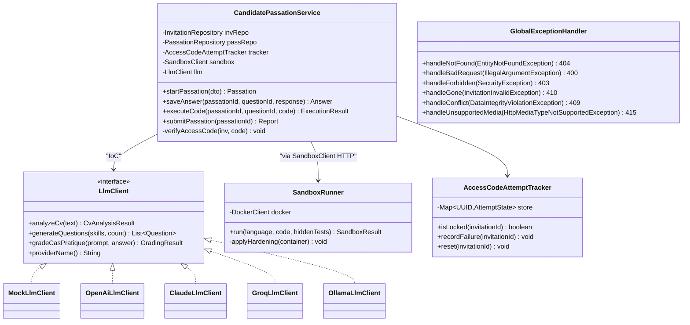
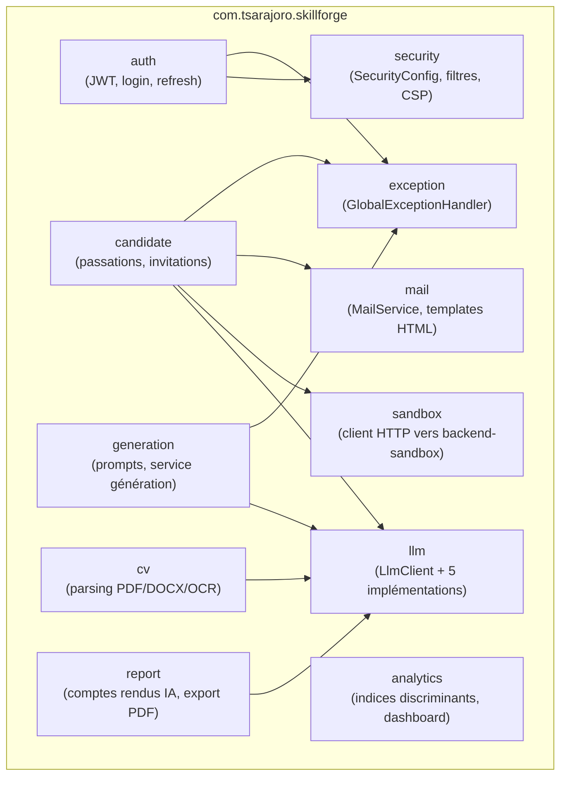
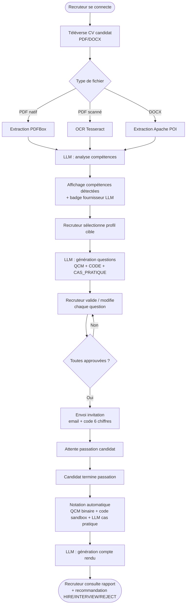
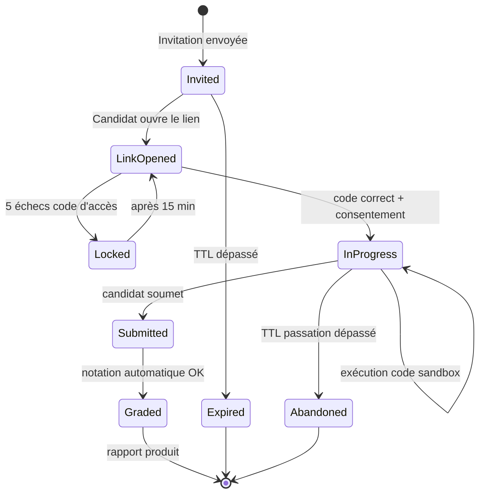
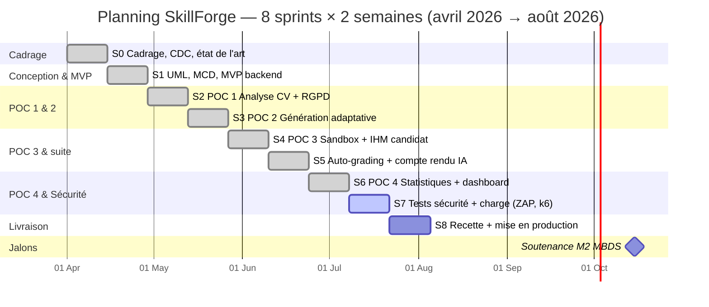
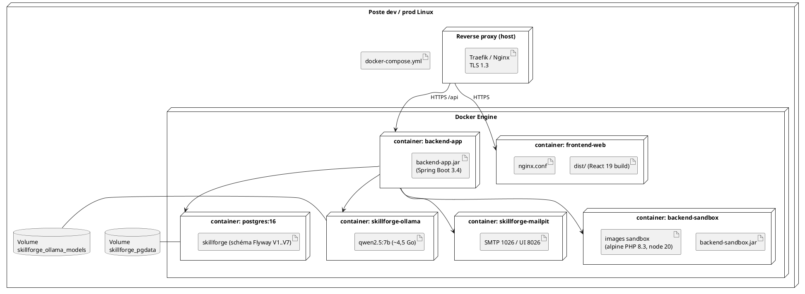

# Fiche diagrammes du mémoire M2 MBDS — SkillForge

Cette fiche rassemble les codes **Mermaid** et **PlantUML** de tous les diagrammes cités dans le mémoire (fichier [MEMOIRE_REDIGE.md](MEMOIRE_REDIGE.md)). Chaque bloc est prêt à copier-coller dans un outil de rendu :

- **Mermaid** → [mermaid.live](https://mermaid.live) → Export PNG ou SVG.
- **PlantUML** → [www.plantuml.com/plantuml](https://www.plantuml.com/plantuml) → Export PNG ou SVG.
- Extension VSCode "Markdown Preview Mermaid Support" pour prévisualiser dans l'IDE.
- Pour le Gantt : soit Mermaid (rapide), soit **GanttProject** (plus pro, format .gan exportable).

Une fois exporté, l'image est à insérer dans le document Word `MEMOIRE-itu-MBDS-v1.docx` à l'endroit indiqué par le titre de section.

---

## Diagramme 1 — Contexte / cas d'usage acteurs (chapitre 1 ou 5)

**Objectif :** montrer les trois acteurs principaux et les grands cas d'utilisation qu'ils déclenchent sur la plateforme.
**Outil recommandé :** PlantUML (rendu use-case plus lisible que Mermaid).



---

## Diagramme 2 — Architecture logicielle en composants (chapitre 6.1)

**Objectif :** montrer les trois blocs déployables (frontend, backend-app, backend-sandbox) et la base de données, avec la justification de l'isolation de la sandbox.
**Outil recommandé :** Mermaid.



---

## Diagramme 3 — Architecture technique (chapitre 6.2)

**Objectif :** vue d'infrastructure serveur : reverse proxy, conteneurs, volumes, réseau externe.
**Outil recommandé :** Mermaid.



---

## Diagramme 4 — Diagramme de séquence US-03 (chapitre 5.1.3 ou 7.2.4)

**Objectif :** décrire finement le flux de démarrage sécurisé d'une passation (verrouillage identité + code d'accès 6 chiffres + rate limiting + comparaison temps constant).
**Outil recommandé :** Mermaid.



---

## Diagramme 5 — Modèle Conceptuel de Données (chapitre 7.2.3)

**Objectif :** représenter les 11 entités principales et leurs relations.
**Outil recommandé :** Mermaid (Entity Relationship Diagram).

```mermaid
erDiagram
    USER {
        uuid id PK
        string email UK
        string password_hash "Argon2id"
        string role "RECRUTEUR / ADMIN"
        timestamp created_at
    }
    CANDIDATE {
        uuid id PK
        string email UK
        string full_name
        timestamp created_at
    }
    CV {
        uuid id PK
        uuid candidate_id FK
        string filename
        bytes content
        string mime_type
        timestamp uploaded_at
        timestamp purge_after "RGPD +12 mois"
    }
    CV_ANALYSIS {
        uuid id PK
        uuid cv_id FK
        string llm_provider
        int tokens_used
        jsonb skills_detected
        timestamp analyzed_at
    }
    SKILL {
        uuid id PK
        string name UK
        string category
    }
    TEST {
        uuid id PK
        uuid candidate_id FK
        uuid created_by_user FK
        string profile_target
        string status
        timestamp created_at
    }
    QUESTION {
        uuid id PK
        uuid test_id FK
        string type "QCM / CODE / CAS_PRATIQUE"
        int difficulty "1..5"
        jsonb payload
        string status "PENDING_REVIEW / APPROVED / REJECTED"
    }
    QUESTION_SKILLS {
        uuid question_id FK
        uuid skill_id FK
    }
    INVITATION {
        uuid id PK
        uuid test_id FK
        string token UK
        string access_code "6 chiffres"
        timestamp expires_at
        timestamp used_at
    }
    PASSATION {
        uuid id PK
        uuid invitation_id FK
        uuid candidate_id FK
        timestamp started_at
        timestamp submitted_at
        boolean consent_given
    }
    ANSWER {
        uuid id PK
        uuid passation_id FK
        uuid question_id FK
        jsonb response
        int score
        string execution_details
    }
    FRAUD_EVENT {
        uuid id PK
        uuid passation_id FK
        string type "TAB_BLUR / PASTE / FULLSCREEN_EXIT"
        timestamp occurred_at
    }
    REPORT {
        uuid id PK
        uuid passation_id FK UK
        int global_score
        string recommendation "HIRE / INTERVIEW / REJECT"
        text explanation
        string llm_provider
        timestamp generated_at
    }

    USER ||--o{ TEST : "crée"
    CANDIDATE ||--o{ CV : "possède"
    CANDIDATE ||--o{ TEST : "cible"
    CV ||--o| CV_ANALYSIS : "analysé par IA"
    TEST ||--|{ QUESTION : "contient"
    QUESTION ||--o{ QUESTION_SKILLS : ""
    SKILL ||--o{ QUESTION_SKILLS : ""
    TEST ||--|| INVITATION : "envoyée via"
    INVITATION ||--o| PASSATION : "démarre"
    PASSATION ||--|{ ANSWER : "produit"
    QUESTION ||--o{ ANSWER : "répondue par"
    PASSATION ||--o{ FRAUD_EVENT : "détecte"
    PASSATION ||--|| REPORT : "génère"
```

---

## Diagramme 6 — Diagramme de classes UML (chapitre 7.2.2)

**Objectif :** vue statique des classes principales du domaine et de leurs responsabilités.
**Outil recommandé :** Mermaid (classDiagram) ou PlantUML pour plus de finesse.



---

## Diagramme 7 — Diagramme de packages (chapitre 7.2.2)

**Objectif :** vue macro de l'organisation "package by feature" du backend.
**Outil recommandé :** Mermaid.



---

## Diagramme 8 — Diagramme d'activité pour un cas d'utilisation clé

**Objectif :** illustrer le flux global "du CV au verdict" côté recruteur, pour montrer l'intégration end-to-end au jury.
**Outil recommandé :** Mermaid.



---

## Diagramme 9 — Diagramme d'états d'une passation (utile pour la fiche de tests)

**Objectif :** montrer le cycle de vie d'une Passation et les transitions autorisées.
**Outil recommandé :** Mermaid.



---

## Diagramme 10 — Planning Gantt macro (chapitre 4.4)

**Objectif :** frise chronologique des 8 sprints du stage.
**Outil recommandé :** Mermaid (rapide) OU **GanttProject** desktop pour un rendu plus pro (export PNG/PDF/HTML).

**Version Mermaid :**



**Version GanttProject (recommandée pour rendu final)** :
1. Créer un projet neuf, dates de début 2026-04-01, fin 2026-08-31.
2. Créer 8 tâches parents "S0 Cadrage" à "S8 Recette", 14 jours chacune, chaînées.
3. Ajouter le jalon "Soutenance" au 2026-10-15.
4. Décomposer S7 et S8 en sous-tâches si tu veux un niveau de détail plus fin.
5. Export → PNG ou PDF → insérer dans le Word.

---

## Diagramme 11 — Diagramme de déploiement (chapitre 7.2.5)

**Objectif :** vue infrastructure et artefacts déployés.
**Outil recommandé :** PlantUML (rendu deployment plus riche).



---

## Résumé — quel diagramme dans quelle section du mémoire

| # | Diagramme | Section MEMOIRE_REDIGE | Outil |
|---|---|---|---|
| 1 | Use-case acteurs | Ch. 1 ou 5 (intro use stories) | PlantUML |
| 2 | Composants (archi logicielle) | Ch. 6.1 | Mermaid |
| 3 | Infrastructure (archi technique) | Ch. 6.2 | Mermaid |
| 4 | Séquence US-03 boîte blanche | Ch. 5.1.3 ou 7.2.4 | Mermaid |
| 5 | MCD / ER Diagram | Ch. 7.2.3 (+ Annexe 2) | Mermaid |
| 6 | Diagramme de classes | Ch. 7.2.2 | Mermaid |
| 7 | Diagramme de packages | Ch. 7.2.2 | Mermaid |
| 8 | Activité "du CV au verdict" | Ch. 5 intro ou soutenance | Mermaid |
| 9 | États d'une passation | Ch. 8.1 (fiche tests) | Mermaid |
| 10 | Gantt 8 sprints | Ch. 4.4 | Mermaid ou GanttProject |
| 11 | Déploiement | Ch. 7.2.5 | PlantUML |

---

## Astuces d'export

- **Mermaid Live** : après rendu, cliquer sur "Actions" → "PNG" (pour Word) ou "SVG" (meilleur pour zoom).
- **Densité** : régler la largeur d'export à 1600–2400 px pour un rendu net dans un Word A4.
- **Thème** : le thème par défaut Mermaid rend bien en noir/blanc pour impression ; passer sur "neutral" ou "forest" si tu veux plus de couleur.
- **PlantUML** : pour un rendu local sans dépendre du site public, `sudo pacman -S plantuml` sur Arch, puis `plantuml diagramme.puml` → génère un PNG à côté.
- **Cohérence visuelle** : garder les 11 diagrammes dans le même style (mêmes couleurs pour "sensible" = sandbox orange, "IA" = violet, "DB" = bleu, etc.) rend le mémoire beaucoup plus pro.

---

*Fiche créée le 2026-08-28 pour accompagner MEMOIRE_REDIGE.md. Les codes ont été alignés sur les vrais noms de classes, tables, ports et sprints du projet SkillForge à cette date.*
