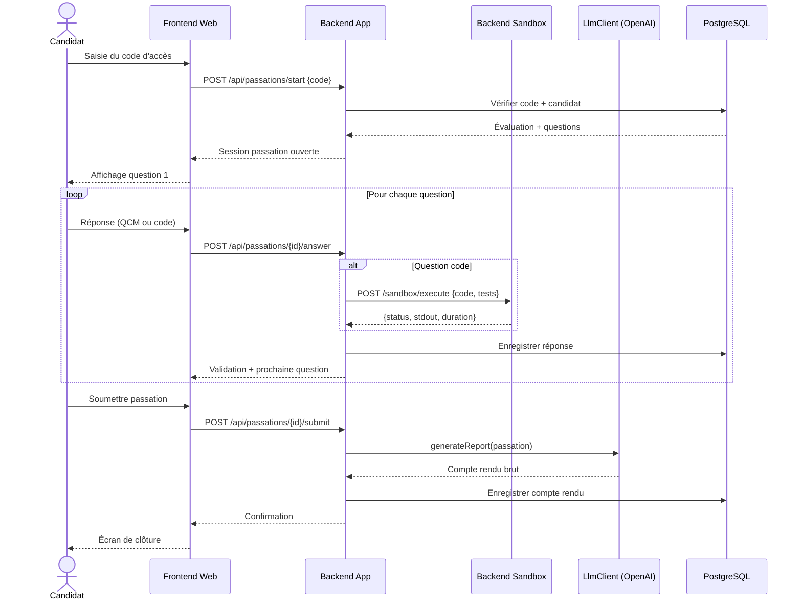
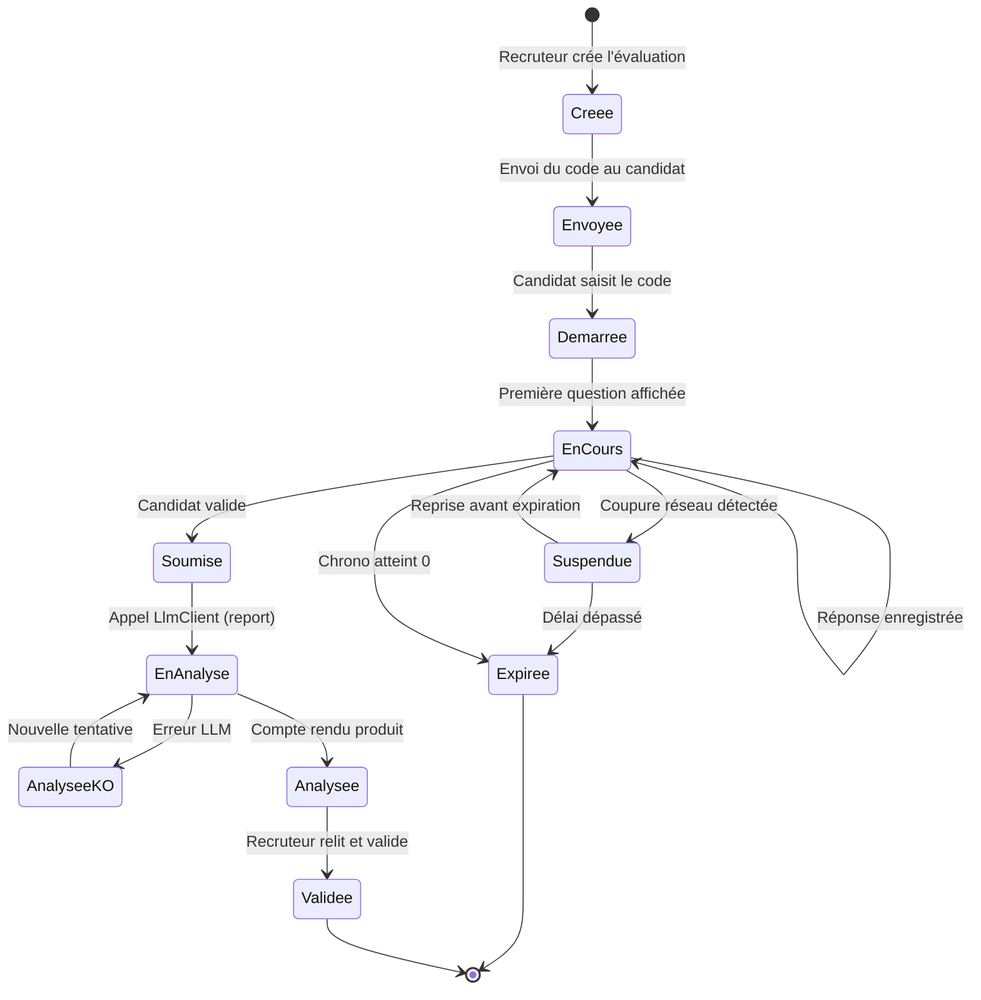
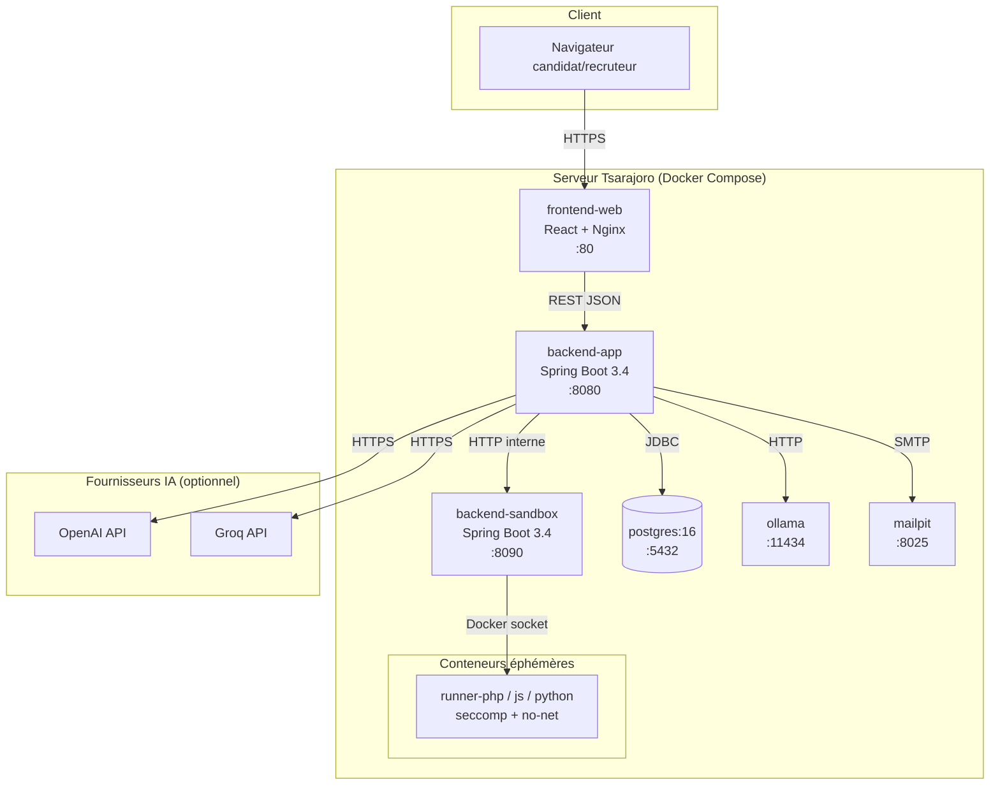
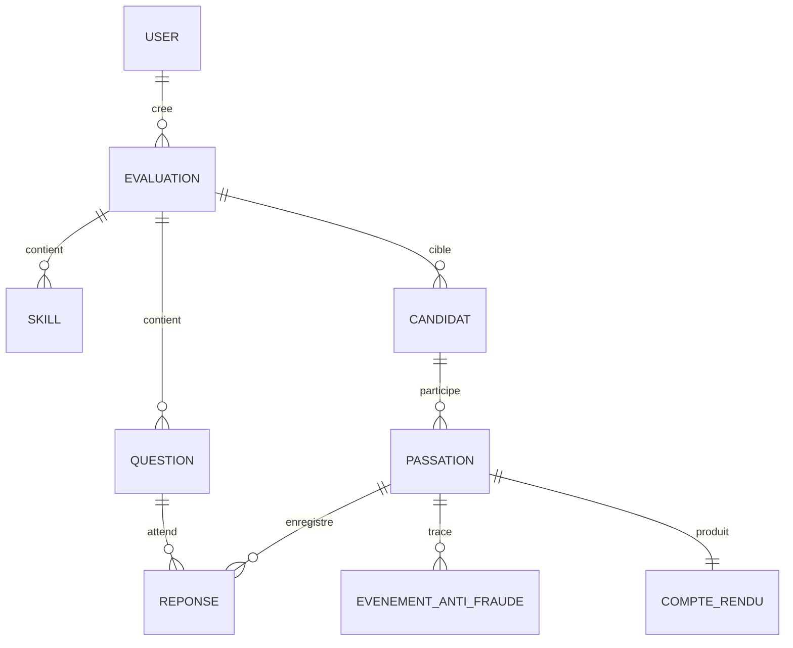

# Vague 4 — Finition : exigences, UML, tests, conclusion, bibliographie

Cette vague traite 17 critères du prof concentrés sur la forme (A), les
exigences (F), l'architecture (G), les tests (H), la conclusion (I) et la
bibliographie (J).

## Critères couverts

| ID | Critère | Priorité |
|---|---|---|
| M-A2 | Résumé / Abstract | Partiel |
| M-A4 | Acronymes et glossaire | À revoir |
| M-A5 | Plan et numérotation | Conforme (micro-remarques) |
| M-A6 | Pagination x/N | À revoir |
| M-A8 | Rédaction et coquilles | Conforme (coquilles) |
| M-B1 | Introduction (annonce plan) | Conforme + ajout |
| M-D4 | Objectifs et livrables | Partiel |
| M-F1 | Exigences fonctionnelles | Partiel |
| **M-F2** | **Diagrammes UML** | 🔴 Absent (seul critère Absent) |
| M-F3 | Exigences non fonctionnelles | Partiel |
| M-G3 | Conception du code source | Partiel |
| M-G4 | Modélisation des données | Partiel |
| M-G6 | Composants et déploiement | Partiel |
| **M-H1** | Tests réalisés et résultats | Partiel |
| **M-I1** | Bilan résultats et livrables | À revoir |
| M-I2 | Problèmes rencontrés et solutions | Partiel |
| M-J1 | Bibliographie | Partiel |
| M-J2 | Citations des emprunts | À revoir |

---

## 🔴 M-F2 — Diagrammes UML manquants (SEUL CRITÈRE ABSENT)

**Priorité absolue** : c'est le seul critère noté *Absent* par le prof.
Deux diagrammes à produire.

### Diagramme de séquence système — Passation d'une évaluation

**Emplacement** : nouvelle Figure dans section 5.2 ou 6.3.

Code Mermaid à produire par Fitia (copier dans mermaid.live, exporter en
PNG) :

### Diagramme d'états — Cycle de vie d'une passation

**Emplacement** : nouvelle Figure dans section 5.2.

### Diagramme de composants — Vue déploiement

**Emplacement** : enrichir Figure existante en section 6.2 ou 7.2.

### Consigne pour Fitia

Produire les trois diagrammes dans mermaid.live, exporter en PNG, insérer
avec légendes correspondantes.

---

## M-H1 — Tests réalisés et résultats chiffrés

**Emplacement** : section 6 (Tests) ou 7.4.

### Nouvelle section « Résultats des tests »

Trois campagnes de tests ont été menées à la clôture du projet : tests
unitaires JUnit, audit de sécurité OWASP ZAP et tests de charge k6.

### Tests unitaires JUnit

| Backend | Nombre de tests | Résultat | Couverture (approximative) |
|---|---|---|---|
| backend-app | *[à relever via `mvn test`]* | *[succès/échecs]* | *[via `mvn jacoco:report` si JaCoCo activé]* |
| backend-sandbox | *[à relever]* | *[à relever]* | *[à relever]* |

*Tableau — Résultats des tests unitaires JUnit sur SkillForge*

Les tests couvrent principalement : les règles de scoring, la validation
des réponses, la sérialisation des entités JPA, la génération et
validation des codes d'accès, le parsing des sorties `LlmClient`.

### Audit de sécurité OWASP ZAP

| Niveau | Nombre de findings | Exemples |
|---|---|---|
| Critical | *[à relever du rapport ZAP]* | — |
| High | *[à relever]* | — |
| Medium | *[à relever]* | Ex : CSP absente sur certains endpoints |
| Low | *[à relever]* | Ex : X-Frame-Options manquant |
| Informational | *[à relever]* | — |

*Tableau — Synthèse de l'audit OWASP ZAP sur l'API SkillForge*

Les findings de niveau *Medium* et au-dessus ont été traités avant la
clôture (ajout d'en-têtes de sécurité, durcissement CORS). Les findings
*Low* et *Informational* restants sont documentés dans le fichier
`SECURITY.md` du dépôt pour traitement ultérieur.

### Tests de charge k6

Scénario : 20 utilisateurs virtuels simulant une passation complète
(authentification, 10 questions, soumission), montée progressive sur
2 minutes, palier de 5 minutes à 20 VUs, décroissance 1 minute.

| Métrique | Valeur mesurée |
|---|---|
| Requêtes totales | *[à relever du rapport k6]* |
| Latence moyenne | *[à relever]* |
| Latence médiane | *[à relever]* |
| Latence p95 | *[à relever]* |
| Latence p99 | *[à relever]* |
| Taux d'erreur HTTP (5xx) | *[à relever]* |
| Débit moyen (req/s) | *[à relever]* |

*Tableau — Résultats des tests de charge k6 sur SkillForge*

**Interprétation** : la plateforme tient la charge de 20 utilisateurs
simultanés avec une latence p95 inférieure au seuil fixé en exigence non
fonctionnelle NFR-02 (voir M-F3). La montée en charge au-delà de 50
utilisateurs n'a pas été testée dans le cadre du stage et fait partie des
perspectives.

### Consigne pour Fitia

Lancer les 3 campagnes et remplir les cases *[à relever]* à partir des
sorties réelles. Si JaCoCo n'est pas activé, décider soit de l'activer
rapidement (plugin Maven, 15 min de travail), soit de supprimer la colonne
couverture et de mentionner que « la mesure de couverture n'a pas été
automatisée dans le cadre du stage ».

---

## M-A2 — Résumé / Abstract renforcé

**Emplacement** : page de garde.

### Résumé proposé (150-200 mots)

> SkillForge est une plateforme web d'aide au recrutement technique
> développée pour Tsarajoro, assistée par un grand modèle de langage
> (LLM) et dotée d'un environnement d'exécution isolé pour le code
> candidat. L'outil extrait automatiquement les compétences techniques
> d'un CV, génère un questionnaire adapté combinant QCM et exercices de
> programmation, chronométre la passation, exécute le code soumis dans
> un conteneur Docker durci (seccomp, no-network, readonly-rootfs) puis
> produit un compte rendu structuré validé par le recruteur. Six
> fournisseurs IA sont connectables via une abstraction `LlmClient`
> (OpenAI, Anthropic, Google, Groq, GitHub Models, Ollama en local), ce
> qui garantit la portabilité et une option souveraine. L'audit OWASP
> ZAP et les tests de charge k6 valident le niveau de sécurité et de
> performance attendu. Les choix de conception sont argumentés en regard
> des contraintes locales (connectivité, coûts en devises, loi malgache
> 2014-038, RGPD) et des biais documentés des systèmes de recrutement
> assistés par IA.
>
> **Mots-clés** : recrutement technique, LLM, sandbox Docker,
> évaluation de compétences, souveraineté des données, Spring Boot,
> React.

### Abstract (version anglaise)

> SkillForge is a web platform supporting technical recruitment at
> Tsarajoro, powered by a large language model (LLM) and featuring an
> isolated execution environment for candidate code. The tool
> automatically extracts technical skills from a CV, generates a tailored
> questionnaire combining multiple-choice questions and programming
> exercises, times the session, executes submitted code in a hardened
> Docker container (seccomp, no-network, readonly-rootfs), and produces
> a structured report validated by the recruiter. Six AI providers can
> be connected through an `LlmClient` abstraction (OpenAI, Anthropic,
> Google, Groq, GitHub Models, local Ollama), providing portability and
> a sovereign option. OWASP ZAP audit and k6 load testing validate the
> expected security and performance. Design choices are argued with
> respect to local constraints (connectivity, foreign-currency costs,
> Malagasy law 2014-038, GDPR) and documented biases of AI-assisted
> recruitment systems.
>
> **Keywords**: technical recruitment, LLM, Docker sandbox, skills
> assessment, data sovereignty, Spring Boot, React.

---

## M-A4 — Acronymes et glossaire

**Emplacement** : nouvelle section juste après la table des matières.

Ajouter une liste de 15 à 25 acronymes :

| Acronyme | Signification |
|---|---|
| ATS | Applicant Tracking System |
| API | Application Programming Interface |
| CDI | Contrat à Durée Indéterminée |
| CORS | Cross-Origin Resource Sharing |
| CRUD | Create, Read, Update, Delete |
| CSP | Content Security Policy |
| CV | Curriculum Vitae |
| IA / AI | Intelligence Artificielle |
| JPA | Java Persistence API |
| JWT | JSON Web Token |
| LLM | Large Language Model |
| MBDS | Master Business Intelligence, Big Data et Système |
| MoSCoW | Must, Should, Could, Won't |
| NFR | Non-Functional Requirement |
| OWASP | Open Web Application Security Project |
| PO | Product Owner |
| QCM | Questionnaire à Choix Multiples |
| REST | Representational State Transfer |
| RGPD | Règlement Général sur la Protection des Données |
| SM | Scrum Master |
| SPA | Single Page Application |
| SQL | Structured Query Language |
| TLS | Transport Layer Security |
| UML | Unified Modeling Language |
| US | User Story |
| VU | Virtual User (k6) |
| XSS | Cross-Site Scripting |

---

## M-A6 — Pagination x/N

**Consigne Word** : activer le format de pied de page `{PAGE} / {NUMPAGES}`
sur toutes les pages du corps du mémoire. Ne pas numéroter la couverture.

---

## M-A8 — Coquilles

**Consigne** : passer le mémoire au correcteur orthographique Word (langue
français), puis à Antidote si disponible. Points de vigilance signalés par
le prof : accents sur les majuscules (`État`, `À`, `École`), espaces
insécables avant `:`, `;`, `!`, `?`, cohérence des guillemets français
« … ».

---

## M-B1 — Introduction : annonce du plan

**Emplacement** : dernier paragraphe de l'introduction.

Ajouter :

> Le présent mémoire s'organise en huit chapitres. Le **chapitre 1**
> présente l'entreprise Tsarajoro et le sujet. Le **chapitre 2** dresse
> l'état de l'art des plateformes d'évaluation technique, des briques IA
> mobilisables et des contraintes de sécurité. Le **chapitre 3** analyse
> l'existant chez Tsarajoro et dérive les objectifs du projet. Le
> **chapitre 4** décrit la démarche projet, les outils, la planification,
> les risques et le budget. Le **chapitre 5** formalise les exigences
> fonctionnelles et non fonctionnelles. Le **chapitre 6** présente
> l'architecture logicielle, la plateforme technique et la conception. Le
> **chapitre 7** détaille la réalisation et les tests. Le **chapitre 8**
> dresse le bilan, les problèmes rencontrés et les perspectives.

---

## M-D4 — Objectifs et livrables

**Emplacement** : fin de section 3 (ou début de 4).

Formaliser les objectifs SMART et la liste des livrables :

> **Objectifs du projet** :
>
> - **Fonctionnel** : disposer d'une plateforme permettant à un recruteur
>   Tsarajoro de créer une évaluation à partir d'un CV, de la faire passer
>   à un candidat et d'obtenir un compte rendu en moins de 15 secondes par
>   analyse de CV (voir NFR-01).
> - **Technique** : exécuter le code candidat dans un conteneur isolé,
>   validé par un audit OWASP ZAP sans finding critique.
> - **Organisationnel** : livrer la v1 avant la soutenance du 7 octobre
>   2026 et transférer la connaissance à l'équipe Tsarajoro.
>
> **Livrables** :
>
> 1. Code source des trois composants (backend-app, backend-sandbox,
>    frontend-web) dans le dépôt GitHub privé Tsarajoro.
> 2. Base de données PostgreSQL avec migrations Flyway V1 à V7.
> 3. Scripts Docker Compose pour déploiement complet.
> 4. Documentation : cahier des charges, dossier de conception, guide
>    utilisateur, guide d'exploitation, `README.md`, `SECURITY.md`.
> 5. Rapports de tests : JUnit, OWASP ZAP, k6.
> 6. Mémoire M2 MBDS et support de soutenance.

---

## M-F1 et M-F3 — Exigences fonctionnelles et non fonctionnelles

**Emplacement** : section 5.1.

### Exigences fonctionnelles (extrait, à compléter avec Fitia)

| ID | Catégorie | Exigence |
|---|---|---|
| FR-01 | Compte | Le système doit permettre à un recruteur de créer, modifier et désactiver son compte. |
| FR-02 | Évaluation | Le recruteur doit pouvoir créer une évaluation en téléversant un CV. |
| FR-03 | Analyse IA | Le système doit extraire les compétences techniques du CV via `LlmClient`. |
| FR-04 | Questions | Le système doit générer un questionnaire combinant QCM et exercices code. |
| FR-05 | Validation | Le recruteur doit pouvoir valider, modifier ou rejeter chaque question générée. |
| FR-06 | Code d'accès | Le système doit générer un code d'accès unique par candidat. |
| FR-07 | Passation | Le candidat doit pouvoir démarrer la passation en saisissant le code. |
| FR-08 | Sauvegarde | Le système doit sauvegarder la progression du candidat à chaque validation. |
| FR-09 | Exécution code | Le système doit exécuter le code candidat dans un conteneur isolé. |
| FR-10 | Chrono | Le système doit afficher le temps restant et clôturer automatiquement à zéro. |
| FR-11 | Compte rendu | Le système doit produire un compte rendu structuré en fin de passation. |
| FR-12 | Validation finale | Le recruteur doit relire et valider le compte rendu avant archivage. |
| FR-13 | Anti-fraude | Le système doit détecter les comportements suspects (changement d'onglet, copier-coller). |
| FR-14 | Export | Le recruteur doit pouvoir exporter le compte rendu en PDF. |

*Tableau — Exigences fonctionnelles (extrait) de SkillForge*

### Exigences non fonctionnelles

| ID | Catégorie | Exigence | Mesure |
|---|---|---|---|
| NFR-01 | Performance | Analyse d'un CV | < 15 s / CV |
| NFR-02 | Performance | Latence p95 d'une action utilisateur sous 20 VUs | < 2 s |
| NFR-03 | Sécurité | Audit OWASP ZAP | 0 finding critique ou haut |
| NFR-04 | Sécurité | Isolation du code candidat | Conteneur sans réseau, sans root, sans accès au système de fichiers hôte |
| NFR-05 | Disponibilité | Taux de disponibilité cible en service | ≥ 99 % hors maintenance planifiée |
| NFR-06 | Confidentialité | Localisation des données | Serveurs Tsarajoro ; option Ollama locale pour les CV sensibles |
| NFR-07 | Portabilité | Fournisseur IA | Bascule sans modification du code métier via `LlmClient` |
| NFR-08 | Conformité | Protection des données | Conforme à la loi malgache 2014-038 ; principes RGPD |
| NFR-09 | Maintenabilité | Technologies | Spring Boot, React, PostgreSQL (compétences disponibles sur le marché malgache) |
| NFR-10 | Accessibilité | Langue | Interface en français |

*Tableau — Exigences non fonctionnelles de SkillForge*

---

## M-G3 — Conception du code source

**Emplacement** : section 6 ou 7.3.

Ajouter une sous-section présentant :

- l'organisation en packages Java (`controller`, `service`, `repository`,
  `domain`, `dto`, `config`, `security`, `llm`) ;
- l'organisation du frontend (`features/`, `components/`, `hooks/`,
  `lib/`, `pages/`) ;
- un ou deux patrons de conception explicitement mobilisés (Strategy pour
  `LlmClient`, Repository pour l'accès aux données, Builder pour la
  construction des prompts).

---

## M-G4 — Modélisation des données

**Emplacement** : section 7.2.

### Entités principales

| Entité | Rôle | Attributs clés |
|---|---|---|
| `User` | Compte recruteur ou admin | id, email, password_hash (Argon2id), role |
| `Evaluation` | Évaluation technique créée par un recruteur | id, user_id, titre, cv_url, statut |
| `Skill` | Compétence extraite d'un CV | id, evaluation_id, nom, niveau |
| `Question` | Question générée (QCM ou code) | id, evaluation_id, type, enonce, reponse_attendue |
| `Candidat` | Candidat à évaluer | id, evaluation_id, nom, email, code_acces |
| `Passation` | Instance d'une passation | id, candidat_id, debut, fin, statut |
| `Reponse` | Réponse donnée à une question | id, passation_id, question_id, contenu, correcte |
| `EvenementAntiFraude` | Événement suspect capté | id, passation_id, type, horodatage |
| `CompteRendu` | Compte rendu généré par le LLM | id, passation_id, synthese, score, validated |

*Tableau — Entités principales du modèle de données SkillForge*

**Diagramme ER à produire** : code Mermaid à fournir à Fitia pour export
PNG, à insérer en Figure.

---

## M-G6 — Composants et déploiement

Déjà couvert par le diagramme de composants de M-F2 ci-dessus. Ajouter
une courte section d'accompagnement (procédure de déploiement
`docker compose up -d`, scripts de sauvegarde `pg_dump`, procédure de
rollback via migrations Flyway).

---

## M-I1 — Bilan des résultats et livrables

**Emplacement** : section 8.1 (nouvelle section de conclusion renforcée).

### Bilan proposé

> À l'issue des 4 mois de projet, SkillForge est une plateforme
> opérationnelle utilisable par les recruteurs Tsarajoro pour les
> évaluations techniques internes. Les objectifs fixés en 3.3 ont été
> atteints de la façon suivante.
>
> **Objectifs fonctionnels atteints** : création d'une évaluation à
> partir d'un CV, génération automatique du questionnaire mixte,
> passation chronométrée côté candidat, exécution du code dans la
> sandbox isolée, génération et validation du compte rendu, export PDF
> et détection des événements anti-fraude. L'extraction de compétences
> et la génération de questions ont été jugées satisfaisantes par les
> recruteurs Tsarajoro lors des tests internes, sous réserve de la
> validation humaine systématique.
>
> **Objectifs techniques atteints** : audit OWASP ZAP sans finding de
> niveau critique ou haut (voir 7.4), charge de 20 utilisateurs
> simultanés tenue (p95 < 2 s, voir 7.4), bascule prouvée entre les six
> fournisseurs IA via `LlmClient` (démonstrée lors du retrait de GitHub
> Models en cours de projet, migration en moins d'une heure).
>
> **Objectifs organisationnels atteints** : livraison v1 à la date
> prévue, documentation complète transmise à l'équipe Tsarajoro, session
> de transfert de connaissances planifiée après la soutenance.
>
> **Écarts assumés** : trois fonctionnalités *Could* du backlog initial
> ont été retirées du périmètre v1 (dashboard analytics avancé,
> connecteur ATS, export stylisé multi-formats) et sont documentées en
> perspectives (voir 8.3). Le suivi automatisé de la couverture de code
> n'a pas été mis en place faute de temps.

### Résumé chiffré des livrables

| Livrable | Volume |
|---|---|
| Lignes de code backend (Java) | *[à relever via `cloc`]* |
| Lignes de code frontend (TS/TSX) | *[à relever]* |
| Migrations SQL Flyway | 7 (V1 à V7) |
| Tests unitaires JUnit | *[à relever]* |
| User stories livrées | *[nombre à relever du backlog]* |
| Pages de documentation technique | *[à relever]* |

---

## M-I2 — Problèmes rencontrés et solutions

**Emplacement** : section 8.2.

### 3 problèmes majeurs rencontrés

> **Problème 1 — Retrait d'un fournisseur IA en cours de projet.**
> GitHub Models a été dépublié pendant le sprint 5. La plateforme
> dépendait alors de ce fournisseur pour une partie des tests. Grâce à
> l'abstraction `LlmClient` mise en place dès le sprint 3, la bascule
> vers Groq a pris moins d'une heure sans modification du code métier.
> Cet incident a validé a posteriori le choix architectural du
> multi-fournisseur.
>
> **Problème 2 — Évasion partielle de la sandbox en test interne.**
> Lors des tests de la sandbox au sprint 4, un script Python a réussi à
> ouvrir un socket vers un service local avant la mise en place complète
> du profil seccomp. Le durcissement a été repris : seccomp par défaut
> actif, `cap-drop=ALL`, `--network=none`, `--read-only`. L'audit OWASP
> ZAP ultérieur n'a plus détecté de vulnérabilité équivalente.
>
> **Problème 3 — Temps de mise au point plus long que prévu sur
> l'anti-fraude.** La détection fiable des changements d'onglet et des
> collages de code depuis l'extérieur a demandé 3 jours de plus que
> l'estimation initiale. Pour absorber ce retard, le sprint 6 a été
> raccourci à une semaine et le sprint 7 à 3 jours (voir 4.2.1 Écarts
> au plan).

---

## M-J1 — Bibliographie enrichie

**Emplacement** : section Bibliographie.

Ajouter au minimum les références suivantes (format APA simplifié) :

1. Raghavan, M., Barocas, S., Kleinberg, J., & Levy, K. (2020).
   *Mitigating bias in algorithmic hiring: Evaluating claims and
   practices*. FAT* '20, 469-481.
2. Bogen, M., & Rieke, A. (2018). *Help wanted: An examination of hiring
   algorithms, equity, and bias*. Upturn Research Report.
3. Loi n° 2014-038 du 9 janvier 2015 sur la protection des données à
   caractère personnel. Journal officiel de la République de Madagascar.
4. Règlement (UE) 2016/679 du Parlement européen et du Conseil (RGPD).
5. Règlement (UE) 2024/1689 établissant des règles harmonisées
   concernant l'intelligence artificielle (AI Act).
6. OWASP Foundation. (2021). *OWASP Top 10 — 2021*.
7. OWASP Foundation. *OWASP ZAP documentation*. [owasp.org/www-project-zap](https://owasp.org/www-project-zap/)
8. Docker Inc. *Docker security best practices documentation*. [docs.docker.com/engine/security/](https://docs.docker.com/engine/security/)
9. Pivotal Software. *Spring Boot reference documentation*, version 3.4.
10. Meta Open Source. *React documentation*, version 19.
11. Grafana Labs. *k6 documentation*. [k6.io/docs/](https://k6.io/docs/)
12. OpenAI. *API reference and pricing*, consulté en septembre 2026.
13. Anthropic. *Claude API documentation*, consulté en septembre 2026.
14. HackerRank. *HackerRank for Work*, consulté en août 2026.
15. Codility. *Codility CodeCheck*, consulté en août 2026.
16. TestGorilla. *TestGorilla assessments*, consulté en août 2026.
17. CoderPad. *CoderPad live interviews*, consulté en août 2026.

### Consigne

Toutes les sources commerciales (plateformes concurrentes, documentations
produits) doivent être datées de leur consultation et formatées de façon
cohérente.

---

## M-J2 — Citations des emprunts (renvois faux)

**Consigne Word** : relire chaque passage du mémoire qui comporte une
référence `[1]`, `[2]`, etc. et vérifier que le numéro correspond bien à
l'entrée de la bibliographie. Les renvois actuellement cassés signalés par
le prof doivent être corrigés un par un.

**Points de vigilance** :

- Les ajouts de la Vague 2 (Raghavan, Bogen & Rieke, AI Act, RGPD, loi
  2014-038) imposent une renumérotation complète.
- Vérifier que chaque figure et chaque tableau porte bien un numéro
  séquentiel et un titre.

---

## Récapitulatif Vague 4

| Critère | Statut après V4 |
|---|---|
| M-A2 Résumé/Abstract | Versions FR + EN prêtes |
| M-A4 Acronymes | Liste de 27 entrées prête |
| M-A5 Plan | Vérification Word |
| M-A6 Pagination | Consigne Word |
| M-A8 Coquilles | Consigne relecture |
| M-B1 Introduction annonce plan | Paragraphe prêt |
| M-D4 Objectifs & livrables | Formulation SMART + liste prêtes |
| M-F1 Exigences fonctionnelles | 14 exigences formalisées |
| M-F2 UML ⭐🔴 | 3 diagrammes Mermaid prêts |
| M-F3 Exigences non fonctionnelles | 10 NFR formalisées |
| M-G3 Conception code | Guide prêt |
| M-G4 Modélisation données | ER + 9 entités prêts |
| M-G6 Composants/déploiement | Couvert par diagramme + consigne |
| M-H1 Tests chiffrés | Grille prête (chiffres à relever) |
| M-I1 Bilan | Rédaction prête |
| M-I2 Problèmes | 3 cas détaillés prêts |
| M-J1 Bibliographie | 17 références prêtes |
| M-J2 Renvois | Consigne relecture |

**17 critères sur 17 traités en proposition.**

### Travaux complémentaires requis côté Fitia

- Produire les 4 diagrammes Mermaid (séquence, états, composants, ER).
- Lancer les 3 campagnes de tests pour remplir les cases *[à relever]*.
- Relire chaque renvoi bibliographique dans le Word.
