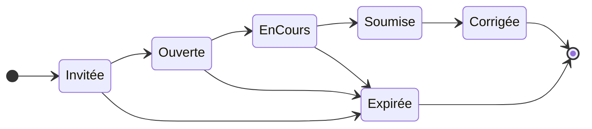

# Correctif M-F2 — Diagrammes UML a ajouter

Ce fichier regroupe tout ce qu'il te faut pour satisfaire le critere M-F2
de la fiche de retour du prof : ajouter un diagramme de sequence systeme
et un diagramme d'etats pour la passation.

**Diagnostic actuel** : la seule UML du chapitre 5 est la Figure 2
(diagramme global des cas d'utilisation). Le prof demande en plus :
1. Un diagramme de sequence systeme (boite noire) ou d'activites pour
   les CU detailles
2. Un diagramme d'etats pour la passation (Invitee, Ouverte, En cours,
   Soumise, Corrigee, Expiree)

**Solution** : 2 nouveaux diagrammes compacts, cibles sur le parcours
d'evaluation global, orientes pour tenir sur une seule page du Word.

---

## 1. Figure 3 — Diagramme d'activites du parcours d'evaluation (horizontal)

Le prof demande "un diagramme de sequence systeme OU un diagramme
d'activites" (fiche M-F2). Pour un rendu **horizontal rectangulaire** qui
tient sur une bande large (gauche-droite), on prend un diagramme
d'activites avec Mermaid flowchart LR.

### 1.1 Code Mermaid

Va sur https://mermaid.live et colle ce code dans l'editeur de gauche :


### 1.2 Rendu attendu

Une bande horizontale **vraiment rectangulaire** avec 8 blocs alignes
de gauche a droite :

```
[Recruteur] -> [CV+test] -> [Invitation] -> [Candidat] -> [Test] -> [Soumet] -> [Correction] -> [Résultats]
```

Les acteurs (Recruteur, Candidat, Resultats) sont en bleu/vert pour
differencier des etapes systeme.

### 1.3 Export PNG

Dans mermaid.live :
1. **Actions → PNG**
2. Options : largeur 1800 px (parce que c'est tres large horizontalement)
3. Theme : default
4. **Download** → sauvegarde sous `figure3-activites-evaluation.png`

### 1.4 Insertion dans le Word

Place la figure **juste apres la section 5.1.4 Consultation des resultats**
(donc avant "5.2 Exigences non fonctionnelles" si c'est le prochain titre).

Redimensionne a **100 % de la largeur de page** (le format tres horizontal
occupe peu de hauteur).

### 1.5 Legende sous la figure

```
Figure 3 : Diagramme d'activités du parcours d'évaluation
```

### 1.6 Phrase courte sous la legende (optionnelle mais recommandee)

```
Ce diagramme présente les principales activités du parcours
d'évaluation, du téléversement du CV à la consultation des résultats.
```

---

## 2. Figure 4 — Diagramme d'etats de la passation

### 2.1 Code Mermaid

Toujours sur https://mermaid.live, nouvel onglet, colle :



**Note importante** : la ligne `direction LR` force l'orientation
horizontale (left-to-right). Sans cette ligne, le diagramme serait
vertical (haut-bas) et prendrait plus de place.

### 2.2 Export PNG

- Width 1400 px (le diagramme est plus large que haut)
- Theme default
- **Download** → sauvegarde sous `figure4-etats-passation.png`

### 2.3 Insertion dans le Word

Juste apres la Figure 3, dans la meme section (apres 5.1.4). Les deux
figures doivent tenir ensemble sur une page du corps du memoire.

### 2.4 Legende sous la figure

```
Figure 4 : Diagramme d'états de la passation
```

### 2.5 Phrase courte sous la legende

```
Le diagramme représente les différents états d'une évaluation, de son
invitation jusqu'à sa correction ou son expiration.
```

---

## 3. Mise en page recommandee dans le Word

### 3.1 Objectif : les 2 figures sur 1 page

Pour que ca tienne :
- Redimensionne chaque figure a 90-95 % de la largeur du corps de texte
- Ne mets qu'**une seule phrase** d'introduction sous chaque legende
- Supprime les sauts de ligne excessifs entre les 2 figures (1 saut de
  paragraphe standard suffit)
- Si la 2e figure deborde encore, reduis les 2 figures a 80 %

### 3.2 Ordre d'insertion

```
5.1.4 Consultation des resultats
[texte existant]

Figure 3 : Diagramme de sequence systeme du parcours d'evaluation
[image sequence]
Ce diagramme presente les principaux echanges entre le recruteur, le
candidat et SkillForge pour la realisation d'une evaluation complete.

Figure 4 : Diagramme d'etats de la passation
[image etats]
Le diagramme represente les differents etats d'une evaluation, de son
invitation jusqu'a sa correction ou son expiration.

5.2 Exigences non fonctionnelles
[section suivante]
```

---

## 4. Impact sur la liste des figures

**Attention** : ces 2 nouvelles figures (3 et 4) vont **tout decaler**
dans la liste des figures. Toutes les figures 3 a 18 actuelles vont
devenir 5 a 20.

### Procedure Word pour renumeroter automatiquement

Si les figures du mémoire ont été insérées via :
- Insertion → Reference croisee → Figure → "Permanent"
- Ou en tant que champs { SEQ Figure \* ARABIC }

Alors Word **renumerote tout seul**. Il suffit de :
1. Clic droit dans la Liste des figures (page 5 du memoire)
2. Mettre a jour les champs → Mettre a jour toute la table

### Si les figures ont ete numerotees manuellement (texte en dur)

Il faut renumeroter a la main :
- Figure 3 (CU global) → reste **Figure 2** (plus bas d'1 car on a pas inserer avant)
- Non pardon, c'est l'inverse : les nouvelles figures 3 et 4 sont **ajoutees**, donc :
  - Figure 3 (actuelle "Interface creation d'une evaluation") devient Figure 5
  - Figure 4 → Figure 6
  - Figure 5 → Figure 7
  - ... et ainsi de suite jusqu'a Figure 18 → Figure 20

Dans la Liste des figures, ajoute 2 nouvelles entrees :
- Figure 3 : Diagramme de sequence systeme du parcours d'evaluation ..... XX
- Figure 4 : Diagramme d'etats de la passation ..... XX

Et incremente de 2 toutes les figures suivantes.

---

## 5. Verification apres integration

- [ ] Figure 3 inseree juste apres 5.1.4
- [ ] Figure 4 inseree juste apres Figure 3
- [ ] Chaque figure a sa legende exacte
- [ ] Phrase d'introduction courte sous chaque figure
- [ ] Les 2 figures tiennent sur 1 page (si possible)
- [ ] Liste des figures mise a jour
- [ ] Pas de reference croisee cassee dans le texte

---

## 6. Argumentaire pour la soutenance orale

Si le jury te demande d'approfondir, voici des reponses pretes :

### Q1 : "Pourquoi un seul diagramme d'activites pour les 4 CU detailles ?"

> « Les 4 CU detailles s'enchainent dans un parcours unique : le recruteur
> analyse un CV, genere un test, invite le candidat, qui passe
> l'evaluation, puis le recruteur consulte les resultats. Un diagramme
> d'activites global presente cet enchainement de maniere plus lisible
> que 4 diagrammes separes. Les details internes de chaque CU sont
> presentes dans le chapitre 7 (conception interne). »

### Q2 : "Pourquoi certains etats de la passation n'apparaissent-ils pas ?"

> « J'ai limite le diagramme aux etats visibles cote metier et aux
> transitions declenchees soit par le candidat soit par le systeme. Les
> etats techniques intermediaires (par exemple la mise en file d'attente
> pour l'execution sandbox) sont des details d'implementation couverts
> par le chapitre 7. »

### Q3 : "Pourquoi un diagramme d'activites et pas un diagramme de sequence systeme ?"

> « Le prof propose les deux dans sa fiche de retour (M-F2). J'ai choisi
> le diagramme d'activites parce qu'il represente mieux le parcours
> global, qui enchaine des actions successives sans retour arriere ni
> echanges aller-retour entre deux acteurs. Le format horizontal
> (gauche-droite) le rend aussi plus lisible pour couvrir les 4 CU
> detailles en une seule figure. Un diagramme de sequence aurait ete
> plus adapte a un seul CU detaille. »

---

## 7. Resume — ce qui est fait pour M-F2

- Diagramme de sequence systeme global ajoute en 5.1 (apres 5.1.4)
- Diagramme d'etats de la passation ajoute juste apres
- 1 phrase explicative sous chaque figure, pas de paragraphe lourd
- Les 2 figures tiennent sur 1 page si bien dimensionnees
- Argumentaire oral prepare pour les 3 questions probables du jury

Le critere M-F2 passe de "Absent" a "Traite" avec ce correctif.
