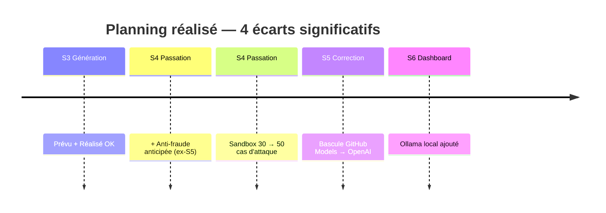

# Corrections slides de soutenance — audit v3

Audit croisé du PDF slides (`V3/etu001776-Slide-soutenance.pdf`, 20 slides) contre la version finale du mémoire (`V3/MEMOIRE-ETU1776-GERSHOM-Fitia-MBDS-v3.pdf`, Introduction → Conclusion 40 pages, Tableau 16 LLM, annexes 6 et 7 ajoutées).

Objectif : garantir la cohérence 1:1 entre le mémoire et les slides avant soutenance et répondre aux critères du prof (S-1 à S-12, dont S-8 critique).

---

## Problèmes détectés et corrections

### 🔴 1. Slide 1 — Faute sur le prénom

**Problème** : « GERSHOM Ny Aina **Fita** » au lieu de « GERSHOM Ny Aina **Fitia** ».

**Correction** : remplacer `Fita` par `Fitia`.

---

### 🔴 2. Slide 1 — Jury incomplet et non cohérent avec la page de garde du mémoire

**Problème** : la slide 1 affiche « Jury : Dr O. Robinson · M. T. Razafinjoelina » alors que la page de garde du mémoire laisse ces noms vides (M. sans nom pour président et examinateur).

**Décision** :
- Si le jury officiel est connu : ajouter ces noms **AUSSI** dans la page de garde du mémoire pour la cohérence
- Si le jury n'est pas confirmé : remplacer dans la slide par « Jury : [À confirmer avant soutenance] » OU retirer la ligne

**Recommandation ferme** : harmoniser mémoire et slide. Les deux doivent dire la même chose.

---

### 🔴 3. Slide 5 — Benchmark incohérent avec le mémoire

**Problèmes multiples** :

| Point | Slide 5 | Mémoire Tableau 1 |
|---|---|---|
| Ordre des colonnes | HackerRank · Codility · CoderPad · TestGorilla | HackerRank · Codility · TestGorilla · CoderPad |
| Prix Codility | 1 200 $ | 1 200 $/an ✅ |
| Prix CoderPad | 960 $ (3e position) | 960 $/an ✅ |
| Prix TestGorilla | 924 $ (4e position) | 924 $/an ✅ |
| Faute « secomp » | « Docker + secomp » | « seccomp » (correct) |

**Corrections** :
1. Mettre les 4 plateformes **dans le même ordre** que le mémoire : HackerRank, Codility, TestGorilla, CoderPad
2. Mettre à jour les prix dans ce nouvel ordre : 948 $, 1 200 $, 924 $, 960 $
3. Corriger `secomp` → `seccomp`

---

### 🔴 4. Slide 9 — Problème S-8 (le plus important)

**Reproche du prof** :
> « Pas de Gantt prévu et réalisé, pas de vélocité, un seul des quatre écarts du mémoire ; la slide est dense avec un texte très petit alors que le reste de la page est vide. »

Les **4 écarts du mémoire** (section 4.3.5) sont :
1. Anti-fraude anticipée (S5 → S4)
2. Durcissement sandbox étendu (30 → 50 cas d'attaque)
3. Bascule GitHub Models → OpenAI (Groq comme secours)
4. Intégration Ollama (fournisseur local)

**Nouvelle structure proposée pour slide 9**

Décomposer la slide en 4 zones claires avec contenu agrandi (texte lisible depuis le fond de la salle).

```
┌────────────────────────────────────────────────────────────────────┐
│ Démarche projet — Scrum, planning et écarts                        │
├────────────────────────────────────────────────────────────────────┤
│                                                                    │
│  [BLOC 1 — HAUT GAUCHE : Gantt condensé prévu vs réalisé]          │
│                                                                    │
│  Prévu  :  S0  S1  S2  S3  S4  S5  S6  S7  S8                      │
│  Réalisé:  S0  S1  S2  S3  S4* S5  S6  S7  S8                      │
│                            └─ anti-fraude anticipée                │
│                                                                    │
│  Charge totale : 90 jours (prévu) → 90 jours (réalisé)             │
│  Vélocité moyenne : ~8,9 j / sprint sur 8 sprints                  │
│                                                                    │
├────────────────────────────────────────────────────────────────────┤
│  [BLOC 2 — HAUT DROITE : les 4 écarts du mémoire]                  │
│                                                                    │
│  ① Anti-fraude  : S5 → S4 (sécuriser plus tôt le parcours)         │
│  ② Sandbox      : 30 → 50 scénarios d'attaque                      │
│  ③ Fournisseur  : GitHub Models → OpenAI (Groq secours)            │
│  ④ Ollama local : ajouté pour souveraineté des données             │
│                                                                    │
├────────────────────────────────────────────────────────────────────┤
│  [BLOC 3 — BAS GAUCHE : Méthode Scrum résumée]                     │
│                                                                    │
│  Méthode Scrum (adaptée stage solo)                                │
│  Sprint 0 (12 j) + 8 sprints (71 j) + tests (4 j) + livraison (3 j)│
│  Suivi hebdomadaire avec encadreur professionnel                   │
│                                                                    │
├────────────────────────────────────────────────────────────────────┤
│  [BLOC 4 — BAS DROITE : Risques + outils]                          │
│                                                                    │
│  Risques (statuts finaux) :                                        │
│  • Qualité IA → prompts renforcés + revue humaine (maîtrisé)       │
│  • Indispo LLM → bascule LlmClient (maîtrisé)                      │
│  • Évolution besoins → re-priorisation sprints (maîtrisé)          │
│                                                                    │
│  Outils : GitHub · Docker · GanttProject · Mermaid · JUnit         │
│          OWASP ZAP · k6                                            │
│                                                                    │
└────────────────────────────────────────────────────────────────────┘
```

**Gantt simplifié en Mermaid** (à coller dans mermaid.live, exporter en PNG et insérer dans la slide 9 ou en annexe de la slide) :

```mermaid
gantt
    title Planning prévisionnel vs réalisé (90 jours)
    dateFormat  X
    axisFormat  %d
    section Prévu
    Sprint 0 Cadrage         :done, 0, 12
    Sprint 1 Fondations      :done, 12, 19
    Sprint 2 Analyse CV      :done, 19, 32
    Sprint 3 Génération      :done, 32, 43
    Sprint 4 Passation       :done, 43, 54
    Sprint 5 Correction      :done, 54, 62
    Sprint 6 Dashboard       :done, 62, 71
    Sprint 7 Tests           :done, 71, 77
    Sprint 8 Recette         :done, 77, 83
    Tests + Livraison        :done, 83, 90
    section Réalisé
    Anti-fraude (S5→S4)      :crit, 43, 54
    Sandbox 50 cas           :crit, 54, 62
    Bascule OpenAI           :crit, 62, 71
    Ollama ajouté            :crit, 71, 77
```



Alternatively, un diagramme Mermaid plus **compact** (format slide, horizontal, lisible) :



**Option C (RECOMMANDÉE)** — Gantt compact à 2 lignes qui montre prévu + réalisé avec les 4 écarts marqués en rouge :

```mermaid
gantt
    title Planning 90 jours — prévu vs réalisé
    dateFormat X
    axisFormat J%d
    section Prévu
    S0 Cadrage         :s0, 0, 12
    S1 à S8 + Livraison :s1, 12, 90
    section Réalisé
    S0 à S3            :r1, 0, 43
    S4 anti-fraude anticipée (ex-S5)    :crit, 43, 54
    S4 sandbox 30 à 50 cas              :crit, 54, 62
    S5 bascule GitHub Models vers OpenAI :crit, 62, 71
    S6 Ollama ajouté                    :crit, 71, 77
    S7 à Livraison     :r7, 77, 90
```



**Pourquoi l'Option C** :
- Format Gantt (répond précisément à la demande du prof : « Gantt prévu et réalisé »)
- Les 4 écarts sont visuellement en rouge (barre `crit:` dans Mermaid)
- Tient horizontalement sur une slide 16:9
- Même durée totale affichée (90 j), fidèle au mémoire

**Procédure** :
1. Aller sur https://mermaid.live
2. Coller le code de l'Option C
3. Ajuster les libellés trop longs si besoin
4. Actions → PNG, width 1800 px
5. Télécharger sous `gantt-slide9.png`
6. Insérer dans la slide 9

**Choisir** : A (gantt classique long), B (timeline simple sans durées), ou **C (gantt compact 2 lignes avec écarts en rouge, recommandée)**.

**Oral à mémoriser (slide 9, ~90 secondes)** :

> « La démarche a suivi un Scrum solo adapté au stage : 8 sprints de 7 à 13 jours, encadrés par un sprint 0 de cadrage et une phase de livraison. La charge totale a été respectée : 90 jours prévus, 90 jours réalisés, soit une vélocité moyenne d'environ 8,9 jours par sprint.
>
> Quatre écarts significatifs ont été observés par rapport au planning initial.
>
> **Premièrement**, j'ai anticipé la détection anti-fraude du sprint 5 au sprint 4, pour sécuriser plus tôt le parcours candidat.
>
> **Deuxièmement**, j'ai étendu le périmètre du durcissement sandbox de 30 à 50 scénarios d'attaque, afin de viser zéro évasion sur un jeu de tests élargi.
>
> **Troisièmement**, le fournisseur initial GitHub Models a vu ses conditions évoluer en cours de projet. J'ai basculé sur OpenAI comme fournisseur principal, en gardant Groq et Ollama comme fournisseurs de secours disponibles via LlmClient.
>
> **Quatrièmement**, l'approfondissement de l'état de l'art sur la protection des données m'a conduit à intégrer Ollama comme fournisseur local, pour permettre un traitement sans transfert vers un cloud externe.
>
> Les trois risques principaux identifiés ont tous été maîtrisés en fin de projet. »

---

### 🔴 5. Slide 13 — Noms de modèles LLM incohérents avec le mémoire

**Problème** : les modèles affichés dans la slide 13 ne correspondent pas à ceux du Tableau 16 du mémoire.

| Fournisseur | Slide 13 | Tableau 16 mémoire |
|---|---|---|
| OpenAI | GPT-4o mini | gpt-4o-mini ✅ |
| GitHub Models | GPT-4o mini | gpt-4o-mini ✅ |
| Groq | **Qwen 3-32B** | **llama-3.1-8b-instant** ❌ |
| Gemini | **Flash 2.5** | **gemini-1.5-flash** ❌ |
| Claude | **Sonnet 4.5** | **claude-3-5-haiku** ❌ |
| Ollama | Qwen 2.5-7B (local) | qwen2.5:7b ✅ |

**Décision à prendre** : quelle version est la vraie ?

Si les modèles de la **slide** sont ceux réellement utilisés en production actuelle, il faut **mettre à jour le Tableau 16 du mémoire**.

Si les modèles du **mémoire** sont ceux utilisés pendant la mesure (coûts, k6, OWASP), il faut **corriger la slide 13**.

**Recommandation** : garder une version unique et stable. Les 3 écarts sont majeurs (Qwen 3-32B vs Llama 3.1 8B n'est pas la même famille de modèle).

**Si tu ne peux pas trancher** : harmonise sur ce qui est **actuellement déployé** en prod/préprod et mets à jour les deux documents en conséquence.

---

### 🔴 6. Slide 10 — Cohérence des exigences mesurées

Vérifier que ces chiffres sont bien ceux du mémoire :

| Slide 10 | Mémoire |
|---|---|
| Performance → p95 < 6 s | Tableau 11 : Capacité « p95 < 6 s » ✅ |
| Sécurité → 0 évasion / 50 scénarios | Section 8.3 ✅ |
| Exécution → timeout 5 s | Annexe 3 ✅ |

**→ Slide 10 cohérente.** Aucune correction nécessaire ici.

---

### 🔴 7. Slide 12 — Faute possible sur « seccomp »

**À vérifier** : la slide affiche-t-elle « seccomp » (correct) ou « secomp » (comme slide 5) ?

D'après l'extraction : « seccomp · filtrage des appels système » → **correct**.

Mais la slide 5 écrivait « secomp ». À corriger slide 5.

---

### ✅ 8. Slide 17 — Résultats mesurés : cohérence confirmée

| Slide 17 | Mémoire |
|---|---|
| 0 évasion / 50 scénarios | Section 8.3 ✅ |
| 100 exécutions valides | Section 8.3 ✅ |
| Médiane 330 ms, p95 422 ms | Section 8.3 ✅ |
| p95 : 4,37 s (k6) | Section 8.4 Tableau 14 ✅ |
| 823/823 checks (k6) | Section 8.4 Tableau 14 ✅ |
| 20 candidats simultanés | Section 8.4 ✅ |
| 27 tests JUnit, 27 réussis, 0 échec | Section 8.1 Tableau 12 ✅ |

**→ Slide 17 parfaitement cohérente.**

---

### 🔴 9. Slide 19 — Problème Difficultés

**Problème** : « GitHub Models indisponible → bascule vers un autre fournisseur via LlmClient » — c'est vague.

**Correction cohérente avec le mémoire corrigé** (section 9.2) :

> « GitHub Models indisponible → bascule vers OpenAI (fournisseur principal) via LlmClient ».

---

### 🔴 10. Slide 19 — Perspectives incohérentes avec mémoire corrigé

**Problème** : la slide dit « déploiement en production ». Le mémoire corrigé dit explicitement :
> « déploiement en production sur l'infrastructure interne de Tsarajoro, afin d'héberger les données candidats directement dans l'environnement de l'entreprise ».

**Correction slide 19** :

> « **déploiement en production sur l'infrastructure interne de Tsarajoro** ; montée en charge ; extension à d'autres langages ; intégration ATS »

---

## Récap des corrections à faire — slides

### Slide 1
- [ ] `Fita` → `Fitia`
- [ ] Harmoniser le jury avec la page de garde du mémoire

### Slide 5
- [ ] Réordonner les 4 plateformes dans l'ordre du mémoire : HackerRank, Codility, TestGorilla, CoderPad
- [ ] Prix dans ce nouvel ordre : 948 $, 1 200 $, 924 $, 960 $
- [ ] `secomp` → `seccomp`

### Slide 9 (le plus gros chantier)
- [ ] Refondre complètement la slide avec 4 zones (Gantt condensé + 4 écarts + Scrum + risques/outils)
- [ ] Ajouter un diagramme Mermaid (timeline ou gantt condensé)
- [ ] Ajouter la vélocité : « ~8,9 j/sprint sur 8 sprints »
- [ ] Lister les 4 écarts (actuellement un seul)
- [ ] Agrandir le texte

### Slide 13
- [ ] Trancher sur les modèles LLM : harmoniser avec le mémoire (Groq llama-3.1-8b-instant, Gemini 1.5-flash, Claude 3-5-haiku) **OU** mettre à jour le Tableau 16 du mémoire si la slide reflète la vraie prod

### Slide 19
- [ ] « bascule vers un autre fournisseur » → « bascule vers OpenAI via LlmClient »
- [ ] « déploiement en production » → « déploiement en production sur l'infrastructure interne de Tsarajoro »

---

## Impact sur le script oral (07_SCRIPT_ORAL_V2.md)

Si tu adoptes la nouvelle structure slide 9, l'oral de cette slide doit être remplacé par le script fourni au point 4 ci-dessus (~90 secondes).

**Autres impacts** : si tu corriges les modèles LLM slide 13, mentionne les mêmes modèles à l'oral.

---

## Impact sur le script vidéo démo (08_SCRIPT_VIDEO_DEMO_V2.md)

Aucun impact direct : la vidéo démo porte sur le parcours utilisateur, pas sur les modèles LLM ni le planning.

**Mais** : si la vidéo affiche un nom de modèle dans la configuration ou dans la bannière de l'app, s'assurer qu'il correspond aux slides et au mémoire.

---

## Vérification finale avant soutenance

Après corrections, chaque fois que tu modifies la slide, vérifie que :
1. **Le mémoire dit la même chose** (chiffres, modèles, ordre des éléments)
2. **Le script oral reprend** les éléments de la slide dans le même ordre
3. **Pas de « seccomp » mal orthographié**
4. **Pas de modèle LLM obsolète**

Après tout ça, la cohérence mémoire ↔ slides ↔ oral ↔ démo sera parfaite, et le reproche S-8 du prof sera levé.
